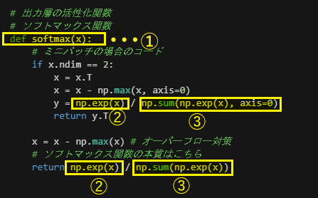
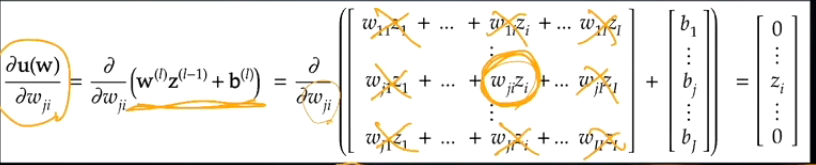
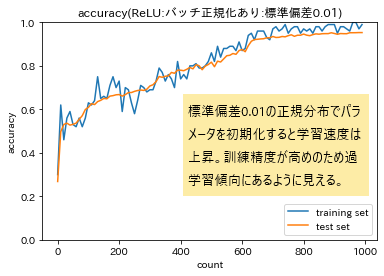
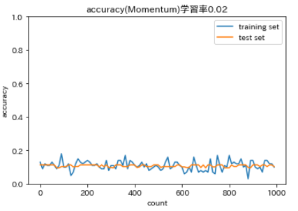
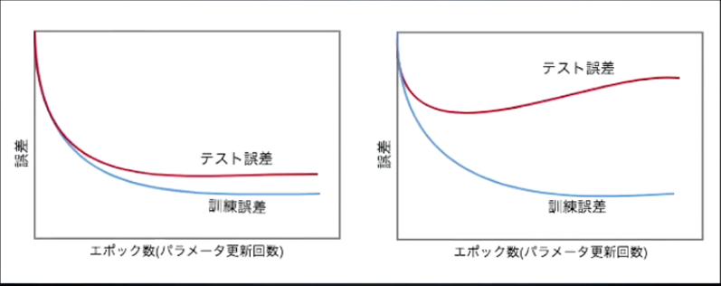
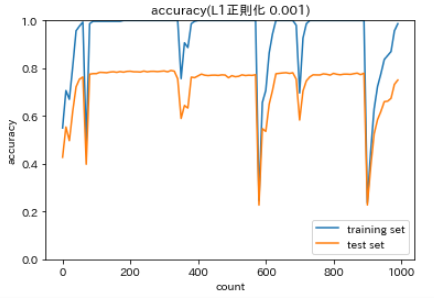

# 実装演習レポート[深層学習その１]

<script type="text/javascript" async src="https://cdnjs.cloudflare.com/ajax/libs/mathjax/2.7.7/MathJax.js?config=TeX-MML-AM_CHTML">
</script>

<script type="text/x-mathjax-config">
 MathJax.Hub.Config({
 tex2jax: {
 inlineMath: [['$', '$'] ],
 displayMath: [ ['$$','$$'], ["\\[","\\]"] ]
 }
 });
</script>

## 1.はじめに

    本レポートはrabbit challenge受講者「Manabu Kobatake」がまとめた
    深層学習day1～day2に係る実装演習レポートです。
    【無断転載禁止】

## 2.Section1:入力層～中間層

    1.識別モデルと生成モデル
      識別モデル
        一般的に人工知能、AIといったキーワードで思い描けるもの
        データを目的のクラスに分類する
        犬や猫の画像のデータを判別
        p(Ck|x)
        xが入力(犬の画像)
        Ckが出力(クラス:犬)
        xが入力として与えられた際、Ckの確率がどうなるか

      生成モデル
        犬という情報から犬の画像を生成する。
        学習した結果、クラスから画像を生成する
        p(x|Ck)
        Ckが入力(クラス：犬)
        xが出力(犬の画像)
        Ckが入力として与えられた際、xの確率がどうなるか
||識別モデル|生成モデル|
|-|-|-|
|具体的なモデル|・決定木<BR>・ロジスティック回帰<BR>・SVM<BR>・ニューラルネットワーク|・隠れマルコフモデル<BR>・ベイジアンネットワーク<BR>・変分オートエンコーダ(VAE)<BR>・敵対的生成ネットワーク(GAN)<BR>|
|特徴|・高次元→低次元<BR>・必要な学習データ：少|・低次元→高次元<BR>・必要な学習データ：多|
|応用例|・画像認識|・画像の超解像<BR>・テキスト生成|

||生成モデル|識別モデル|識別関数|
|-|-|-|-|
|識別の計算|$ p(x\|C_k)\cdot p(C_k)$ を推定<BR>ベイズの定理より<BR>$ p(C_k\|x)=\frac{p(x\|C_k)\cdot p(C_k)}{p(x)} $<BR>ただし$p(x)=\displaystyle \sum_k p(x\|C_k)p(C_k)$|$p(C_k\|x)$を推定<BR>閾値など、決定理論に基づき識別|入力値xを直接クラスに写像(変換)する関数(x)を推定|
|モデル化の対象|・各クラスの生起率<BR>・データのクラス条件付密度|・データがクラスに属する確率|・データの属するクラスの情報のみ<BR>※確率は計算されない|
|学習コスト|大|中|小|

    データのクラス条件付密度は分類結果より複雑で、生成モデルはこの分布を推定する。計算量が多い。
    分布を正しく把握しようとするアプローチ

    単に分類結果を得るのであれば、直接データがクラスに属する確率を求める→分類モデルのアプローチ

    ・識別モデル（確率的識別モデル）
      ①"推論"により事後確率$p(C_k\|x)$を求め、これにより識別結果を②"決定"する。
      →間違いの程度を図ることができる。
      →推論結果の取り扱いを決められる。(棄却)

    ・識別関数（決定的識別モデル）
      入力データをもとに直接識別結果を推定する。
        →間違いの程度、確率は測ることができない。

      万能近似定理
      世の中のあらゆる非線形の事象はニューラルネットワークの活性化関数によるおおよそ近似できる。

    ニューラルネットワーク
      動物の識別モデルの構築を例にする。
        ・入力層
          体長、体重、ひげの本数、毛の平均長、耳の大きさ、眉間/目鼻距離比、足の長さなどの特徴量を受け取る層
          各特徴量はそれぞれ独立したノードに対応する

        ・中間層
          入力層の各ノードの特徴量とそれぞれに対応するパラメータw(重み),b(バイアス)を掛け合わせて学習し、活性化関数を介して中間層の出力zを生み出す層

$総入力:u=b+w_1x_1+w_2x_2+w_3x_3\cdots+w_nx_n=W\cdot x+b$

          重みwは傾きの度合いを調整
          バイアスbは切片を調整

        ・出力層
          中間層の情報を基に各クラスに属する確率を出力する

$$
【事前に用意する情報】\\\\
入力：X_n = \begin{Bmatrix}X_{n1}\cdots x_{ni} \end{Bmatrix} \\\\
訓練データ：d_n = \begin{Bmatrix}d_{n1}\cdots d_{nk} \end{Bmatrix}
$$

$$
【 多層ネットワークのパラメータ 】\\\\ 
w^{(l)}=
\begin{Bmatrix} 
重み： & W^{(l)} \\\\
バイアス： & b^{(l)}
\end{Bmatrix}
$$

$$
重み:W^{(l)}=
\begin{bmatrix}
w_{11}^{(l)} & \cdots & w_{1I}^{(l)} \\\\
\vdots & \ddots & \vdots \\\\
w_{J1}^{(l)} & \cdots & w_{JI}^{(l)} \\\\
\end{bmatrix}\\\\ 
$$

$$
バイアス:b^{(l)}=\begin{bmatrix}
b_{(1)}^{(l)}\cdots b_{(J)}^{(l)}
\end{bmatrix}
$$

$$
活性化関数:f^{(l)}(u^{(l)})=
\begin{Bmatrix}
f^{(l)}(u_1^{(l)}) \cdots f^{(l)}(u_J^{(l)})
\end{Bmatrix}
$$

$$
中間層出力:z^{(l)}=
\begin{Bmatrix}
z_{1}^{(t)} \cdots z_{K}^{(t)}
\end{Bmatrix}=f^{(l)}(u^{(l)})
$$

$$
総入力:u^{(l)}=W^{(l)}z^{(l-1)}+b^{(l)}
$$

$$
出力:y_n^{(t)}=
\begin{bmatrix}
y_{n1}^{(t)} \cdots y_{nK}^{(t)}
\end{bmatrix}=Z^{(L)}
$$

$$
誤差関数:E_n(W)
$$

$$
層(レイヤ)ーのインデックス: l(=1\cdots L) \\\\ 
入力層ノードのインデックス: i(=1\cdots I) \\\\ 
中間層ノードのインデックス: j(=1\cdots J) \\\\ 
出力層ノードのインデックス: k(=1\cdots K) \\\\ 
$$

    ニューラルネットワークの扱う問題
      ・回帰
        結果予想
          売上予想
          株価予想
        ランキング
          競馬順位予想
          人気順位予想
      ・分類  
        猫の写真の識別
        手書き文字認識
        花の種類分類

      【回帰分析】
        連続する実数値を取る関数の近似
        ・線型回帰
        ・回帰木
        ・ランダムフォレスト
        ・★ニューラルネットワーク(NN)★

      【分類分析】
        性別や動物の種類など、離散的な結果を予想するための分析
        ・ベイズ分類
        ・ロジスティック回帰
        ・決定木
        ・ランダムフォレスト
        ・ニューラルネットワーク(NN)

      万能近似定理により、回帰・分類双方に適用可能        
        何かしらの入力を数字として取って何かしらの結果を数字に変換して出力する→ニューラルネットワーク
        （画像、文章も数値に変換することにより扱える）
    
    深層学習
      4つ以上の層を持つニューラルネットワークによる学習を深層学習と呼ぶ。
      【深層学習の実用例】
      ・自動売買（トレード）
      ・チャットボット
      ・翻訳
      ・音声解析
      ・囲碁、将棋AI

    入力として取りうるデータ(数値の集まり)
      ・連続する実数  
      ・確率
      ・フラグ値　[0,0,1]…One-Hot-Label
    
    入力層として取るべきでないデータ
      ・欠損値が多いデータ（学習に役に立たない。補完ないし除去が推奨される）
      ・誤差の大きいデータ（学習に役に立たない）
      ・出力そのもの、出力を加工した情報（恣意的な加工が学習に悪影響を与える）
          ※生のデータから出力までを一発で学習させる手法を
          End-To-Endの学習といい理想的な手法となる。
      ・連続性のないデータ（背番号、ID）
      ・無意味な数が割り当てられているデータ
        ・悪い例 Yes:1,No:0,どちらでもない:-1,無回答:-1
          (どちらでもない、無回答の区別ができない)
        ・良い例 Yes:1,No:-1,どちらでもない:0,無回答:なし

    欠損値の扱い
      ・ゼロで詰める（ただし、
      ・欠損値を含む集合(レコード)を除外（1行を取り除く）
      ・入力として採用しない（1列を取り除く）
    ・データの結合

    ・数値の正規化・正則化
        正規化：スケールの大きな値を0～1の範囲内に収める
        正則化：正規分布となるよう切片を調整

    転移学習
      入力層に近い側はデータの基本的な特徴を捉える
      特徴量抽出とタスク固有処理にわけることができる。
      特徴量抽出は学習コストが高いので、極力コストを抑えたいというモチベーションが働く。
      基本的な特徴量は、目的に関わらず応用できる
      学習済み重み・・・入力層に近い一部分で精度が高いもの。
      ・ファインチューニング・・・学習済み重みも含め再学習する。
      ・転移学習・・・この学習済み重みを用いタスク固有の学習を行う
      ・プリトレーニング・・・教師なし学習で特徴量抽出器を作る。

### 2-1.講義内容まとめ

    ニューラルネットワークにおいても線型回帰やロジスティック回帰同様に、特徴量Xごとの数値を行列式として受け取るが、この部分が入力層に当たる。
    特徴量Xがそれぞれ独立したノードに対応した重みパラメータWとのドット積を計算し、バイアスbとの合算が中間層に与えられる。
    この際、入力層の各ノードの特徴量Xと重みパラメータWの計算結果は、中間層の各ノードにそれぞれ振り分けられる。
    中間層の層の数が単一とは限らず、複数の層で構成されている場合は、1層目の出力結果と1層目用の重みパラメータにより算出された結果が2層目の入力として与えられる。
    ニューラルネットワークは画像・音声・文章などのさまざまな情報を特徴量として数値化し、回帰分析・分類分析において近似した結果を得られることができる。
    これを万能近似定理という。

### 2-2.実装演習結果

      [後述の確認テスト.5参照](#2-3確認テスト考察結果)

### 2-3.確認テスト考察結果

      ■確認テスト1.ディープラーニングは何をしようとしているのか。
      またどの値の最適化が最終目的か。
      [考察]
        ディープラーニングも広義のプログラムと呼べるが、明示的なルールベースのロジックに基づいて
        判断しているわけではなく、あくまで入力値（訓練データ含む）をニューラルネットワーク上を経由して最終的に欲している出力値に変換するモデルを構築することにある。
        その過程において、重み[w]とバイアス[b]を最適化することが重要なポイントになる。
        なお、あくまで数ある機械学習の手法の内の一つである。
        ディープラーニングも細分化され、以下のように細分化された分類が存在する。
        ・DNN（Deep Neural Network，ディープニューラルネットワーク）
        ・CNN（Convolutional Neural Network，畳み込みニューラルネットワーク）
        ・RNN（Recurrent Neural Network，再帰型ニューラルネットワーク）

      ■確認テスト2.次のネットワークを神に書け
        入力層：2ノード1層
        中間層：3ノード2層
        出力層：1ノード1層


    [考察]上記ネットワーク図を行列式に置き換えて表現してみた。

$$
X \quad \cdot \qquad W_1 \qquad \rightarrow \quad U^{(1)} \quad \cdot \qquad \qquad W_2 \qquad \quad \rightarrow \quad U^{(2)} \cdot \quad \qquad W_3 \qquad \rightarrow y \\\\
\begin{bmatrix}
x_1 \\\\ x_2
\end{bmatrix}\cdot
\begin{bmatrix}
w_{11} & w_{12} \\\\ 
w_{21} & w_{22} \\\\ 
w_{31} & w_{32} \\\\ 
\end{bmatrix}\rightarrow
\begin{bmatrix}
u_{1}^{(1)} \\\\ 
u_{2}^{(1)} \\\\ 
u_{3}^{(1)} \\\\ 
\end{bmatrix}\cdot
\begin{bmatrix}
w_{11} & w_{12} & w_{13} \\\\ 
w_{21} & w_{22} & w_{23} \\\\ 
w_{31} & w_{32} & w_{33} \\\\ 
\end{bmatrix}\rightarrow
\begin{bmatrix}
u_{1}^{(2)} \\\\ 
u_{2}^{(2)} \\\\ 
u_{3}^{(2)} \\\\ 
\end{bmatrix}\cdot
\begin{bmatrix}
w_{11} & w_{21} & w_{31} \\\\ 
\end{bmatrix}\rightarrow y
$$

      ■確認テスト3.この図式に動物分類の実例を入れてみよう


      [考察]
        入力層の各ノードにはそれぞれ特徴量を表す数値が設定されている。
        極端に広い範囲の値をとる特徴量はないが、もしそのようなデータが
        ある場合は、外れ値を除く、正規化を行うといった手当が必要となる。

      確認テスト4.この数式をPythonで書け
$u=w_1x_1+w_2x_2+w_3x_3\cdots w_nx_n+b=Wx+b$

```python
u=np.dot(x,W)+b
```

      ■確認テスト5.1-1のファイルから中間層の出力を定義しているソースを抜き出せ。

```python
# プロセスを作成
def forward(network, x):
    print("##### 順伝播開始 #####")
    
    W1, W2 = network['W1'], network['W2']
    b1, b2 = network['b1'], network['b2']
    # 隠れ層の総入力
    u1 = np.dot(x, W1) + b1
    # 隠れ層の総出力
    z1 = functions.relu(u1)   ### ←■ココ！！■
    # 出力層の総入力
    u2 = np.dot(z1, W2) + b2
    # 出力層の総出力
    y = u2
    
    print_vec("総入力1", u1)
    print_vec("中間層出力1", z1)
    print_vec("総入力2", u2)
    print_vec("出力1", y)
    print("出力合計: " + str(np.sum(z1)))
    
    return y, z1
```

## 3.Section2:活性化関数

    活性化関数とは、ニューラルネットワークにおいて、
    次の層への出力の大きさを決める"非線形"の関数のことをさす。
    入力値の値によって、次の層への信号のON/OFFや強弱を定める働きを持つ。
    なお、中間層と出力層で利用される関数の種類は異なる。

    活性化関数は以下の式で表される。
    活性化関数の効果で一部の出力を強く、一部は弱く伝播される。

$$
活性化関数:f^{(l)}(u^{(l)})=
\begin{Bmatrix}
f^{(l)}(u_1^{(l)}) \cdots f^{(l)}(u_J^{(l)})
\end{Bmatrix}
$$

||&nbsp;&nbsp;&nbsp;&nbsp;名称&nbsp;&nbsp;&nbsp;&nbsp;|説明|&nbsp;&nbsp;&nbsp;&nbsp;サンプルコード&nbsp;&nbsp;&nbsp;&nbsp;|課題|
|:-:|:-:|:-:|:-:|:-:|
|中間層|ReLU関数|今もっとも使われている活性化関数。<BR>勾配消失問題の回避とスパース化に貢献することで<BR>良い成果をもたらしている。|def relu(x):<BR>&nbsp;return np.maximum(0,x)|&nbsp;|
|^|シグモイド（ロジスティック）関数|0～1の間を緩やかに変化する関数で、<BR>ステップ関数ではON/OFFしかない状態に対し、<BR>信号の強弱をつけられるようになり、<BR>予想ニューラルネットワーク普及の切欠となった。|def sigmoid(x):<BR>&nbsp;return 1/(1+np.exp(-x))|大きな値では出力の変化が微小なため、<BR>勾配消失問題を引き起こすことがあった|
|^|ステップ関数|閾値を超えたら発火する関数であり、出力は常に1か0。<BR>パーセプトロン(ニューラルネットワークの前身)で利用された関数。<BR>|def ste_function(x):<BR>&nbsp;if x>0:<BR>&nbsp;&nbsp;return 1<BR>&nbsp;else:<BR>&nbsp;&nbsp;return 0|0-1の間を表現できず、<BR>線型分離可能なものしか学習できなかった。|

    まず学習には、事前に入力データと、対となる訓練データが必要となる。
    入力層から入力データが投入され、中間層で変換された結果を出力層で受け取った際、変換された結果を訓練データdと比較する。
    実際に訓練データと比較して現れた誤差を表現するものが誤差関数という。
    誤差関数では、各数値の差が大きいほど正答から遠い、差が少ないほど正答に近いことを表し、二乗和誤差などの方法で表す。

$$
E_n(W) = \frac{1}{2} \displaystyle \sum_{j=1}^J(y_j-d_j)^2 = \frac{1}{2}||(y-d)||^2
$$

### 3-1.講義内容まとめ

    活性化関数は出力に-1～1の範囲の値を取ることが多く、入力層のデータと重みの算出結果からその特徴の強度を測るものと言える。
    活性化関数には中間層と出力層で用いられるものに違いが見られる。
    また、ステップ関数の表現力の乏しさを解決するためのシグモイド関数、またシグモイド関数の引き起こす勾配消失問題を解決するためのRELU関数といったように、ニューラルネットワークの発展に伴い使用される関数が進化している。
    活性化関数として何を選定するかによって学習の精度が左右されることがあるため、
    それぞれの特性を理解して活用することが求められる。

### 3-2.実装演習結果

      各活性化関数の実装と特性をまとめる。

```python
# 中間層の活性化関数
# ステップ関数（閾値0）
def step_function(x):
    return np.where( x > 0, 1, 0) 

# シグモイド関数（ロジスティック関数）
def sigmoid(x):
    return 1/(1 + np.exp(-x))

# ReLU関数
def relu(x):
    return np.maximum(0, x)

```

|グラフ|説明|
|:-:|:-:|
||0を境にON/OFFが明確|
||両端に向け滑らかな曲線を描く|
||0未満は0、0以上は直線を描く|

### 3-3.確認テスト考察結果

    確認テスト：線形と非線形の違いを図にかいて簡易に説明せよ

|線型|非線形|
|:-:|:-:|
|||
|・加法性:$f(x+y)=f(x)+f(y) $<BR>・斉次性:$f(kx)=kf(x)$|左記特性を持たない|

    ・線型な関数は、以下の特性を持つが、非線形な関数はこの特性を持たない

    確認テスト：誤差関数においてなぜ単純な引き算ではなく、二乗するか述べよ。
      また、下式の1/2はどういう意味を持つのか述べよ。

$E_n(W)=\frac{1}{2} \displaystyle \sum_{j=1}^J(y_j-d_j)^2=\frac{1}{2}\Vert (y-d)\Vert^2$

      二乗する理由：単純に各クラスごとの差を足し合わせると正負の符号が相殺され0になってしまう。二乗することによりマイナス符号を取り払い、誤差の大きさを正しく計測できるようにするため

      2分の1する理由：誤差逆伝搬の計算で微分する際、乗数の2が数式の前に移動するので、ちょうど相殺されて見やすくするよう、便宜上付加している。本質的な意味はない。

## 4.Section3:出力層

    出力層と中間層の違いは何か
    【値の強弱】
      ・中間層: 閾値の前後で信号の強弱を調整
        
      ・出力層: 信号の大きさ（比率）はそのままで変換
        →中間層で抽出された情報を我々が認識できる形に変換する。
    
    【確率出力】
      ・分類問題の場合、出力層がとりうる値は0～1の範囲とし、総和を1とする。
      　犬・猫の2クラスに分類する場合
          猫：0.7
          犬：0.3

      出力層と中間層で利用される活性化関数が異なる。

    誤差関数は用途によって使用すべき関数が異なる。
      分類問題：クロスエントロピー誤差
        loss = cross__entropy_error(d,y)
      回帰問題：平均二乗誤差
        loss = mean_squared_error(d,y)

    出力層における活性化関数と誤差関数の組み合わせ
||回帰|二値分類|多クラス分類<BR>(3クラス以上)|
|:-:|:-:|:-:|:-:|
|活性化関数|恒等写像<BR>$f(u)=u$<BR>入力値をそのまま返す|シグモイド関数<BR>$f(u)=\frac{1}{1+/exp^{-u}}$|ソフトマックス関数<BR>$f(i,u)=\frac{e^{u_i}}{\sum_{k=1}^K e^{u_k}}$<BR>iがラベルに相当|
|誤差関数|二乗誤差|交差エントロピー|<|

【訓練データサンプルあたりの誤差】
$$
E_n(W)=\frac{1}{2} \displaystyle \sum_{i=1}^I(y_n-d_n)^2 \cdots 二乗誤差 \\\\
E_n(W)=-\displaystyle \sum_{i=1}^Id_i\log{y_i} \cdots 交差エントロピー \\\\
$$

### 4-1.講義内容まとめ

    出力層は入力層から前段の中間層にて各信号の強弱を調整された結果から、
    各信号間の比率を人が認識できる形に変換する層と言える。
    中間層と同様、前段の出力を活性化関数により変換するが、
    中間層で用いたものとは異なる関数を用いる。
    また、活性化関数の出力を別途与えられた訓練データと比較し、その確からしさを
    測るための誤差関数を用いるのも出力層の特徴である。
    誤差関数は回帰問題と分類問題で利用するものが異なり、
    分類問題の場合クロスエントロピー誤差、回帰問題の場合は平均二乗誤差を用いる。
    この誤差関数で測った誤差を限りなくゼロに近づけること、
    ひいてはパラメータと切片を調整することが深層学習の目的となる。

### 4-2.実装演習結果

    出力層における活性化関数、誤差関数のコードと特性についてまとめる。

```python
# 出力層の活性化関数
# ソフトマックス関数
def softmax(x):
    if x.ndim == 2:
        x = x.T
        x = x - np.max(x, axis=0)
        y = np.exp(x) / np.sum(np.exp(x), axis=0)
        return y.T

    x = x - np.max(x) # オーバーフロー対策
    return np.exp(x) / np.sum(np.exp(x))

# ソフトマックスとクロスエントロピーの複合関数
def softmax_with_loss(d, x):
    y = softmax(x)
    return cross_entropy_error(d, y)

# 誤差関数
# 平均二乗誤差
def mean_squared_error(d, y):
    return np.mean(np.square(d - y)) / 2

# クロスエントロピー
def cross_entropy_error(d, y):
    if y.ndim == 1:
        d = d.reshape(1, d.size)
        y = y.reshape(1, y.size)
        
    # 教師データがone-hot-vectorの場合、正解ラベルのインデックスに変換
    if d.size == y.size:
        d = d.argmax(axis=1)
             
    batch_size = y.shape[0]
    return -np.sum(np.log(y[np.arange(batch_size), d] + 1e-7)) / batch_size
```

### 4-3.確認テスト考察結果

    ■確認テスト：①～③の数式に該当するソースコードを示し、一行ずつ処理の説明をせよ

ソフトマックス関数:$①\cdots f(i,u)=\frac{e^{u_i}\cdots ②}{\sum_{k=1}^K e^{u_k}\cdots ③}$



    ソフトマックス関数の本質はreturn文に記載されている箇所に相当する。
    前段のロジック(if文で引数が2次元の場合～)は後述するミニバッチ法にて用いられるロジック。


    ■確認テスト：①～②の数式に該当するソースコードを示し、一行ずつ処理の説明をせよ

交差エントロピー関数:$E_n(W)=-\displaystyle \sum_{i=1}^Id_i\log{y_i}$


## 5.Section4:勾配降下法

    勾配降下法（ニューラルネットワークを学習させる手法）の種類
    ・勾配降下法
    ・確率的勾配降下法
    ・ミニバッチ勾配降下法

    深層学習の目的は、学習を通して誤差を最小に調整したネットワークを生成すること。
    つまり誤差E(W)を最小化するパラメータwを発見すること

$$
W^{(t+1)}=W^{(t)}-\epsilon \nabla E \\\\
\nabla E=\frac{\partial E}{\partial W}=
\begin{Bmatrix}
\frac{\partial E}{\partial w_1}\cdots \frac{\partial E}{\partial w_M}
\end{Bmatrix} \\\\
t\cdots 学習の回数(t…前回、t+1次回) \\\\
\epsilon \cdots 学習率 \\\\
$$

    学習率の設定の仕方により学習の効率が左右される
      ・学習率が大きいと発散してしまい、収束しない。
        (ちょうど、バスケットボールをシュートして、ゴールに入らず反射してこぼれてしまうイメージ)


      ・学習率が小さいと発散は起きないが時間がかかる。
      　また、底が複数ある場合、途中にある局所極小解に陥ってしまう。


    勾配降下法の学習率の決定、収束性向上のためのアルゴリズムについて複数の論文が公開され、利用されている。
      ・Momentum
      ・AdaGrad
      ・AdaDelta
      ・Adam

    入力層から中間層を経て、出力層にて誤差関数で求められた間違いの度合いをもとに重みw、バイアスbを調整する。そして次の周(エポック)に反映して学習を進める。
    ・画像認識の場合、1クラスあたり1000枚～5000枚の画像があればよい結果が得られる

|ミニバッチ勾配降下法法|確率的勾配降下法|勾配降下法|
|:-:|:-:|:-:|
|$W^{(t+1)}=W^{(t)}-\epsilon \nabla E_t$<BR>$E_t=\frac{1}{N_t}\displaystyle \sum_{n\in D_t} E_n $<BR>$N_t=\|D_t\|$|$W^{(t+1)}=W^{(t)}-\epsilon \nabla E_n$|$W^{(t+1)}=W^{(t)}-\epsilon \nabla E$|
|ランダムに分割したデータの集合<BR>(ミニバッチ)$D_T$に属するサンプルの平均誤差|ランダムに抽出したサンプルの誤差|全サンプルの平均誤差|

    確率的勾配降下法のメリット
      ・データが冗長な場合の計算コストの軽減
      ・望まない局所極小解に収束するリスクの軽減
      ・オンライン学習ができる

    バッチ学習とオンライン学習
      ・バッチ学習：全データを準備して一気に学習する。大量のデータを扱うにはメモリなどのハードスペックが求められる。
      ・オンライン学習：事前に全データを準備するのではなく、モデルに対して学習データが与えられるたびに都度パラメータを更新して徐々に学習を進める。

    ミニバッチ勾配降下法のメリット
      10万枚の画像を学習させるには…500枚など小分けにして学習させる。
      この小分けの単位をミニバッチという
      10万枚・・・1つのミニバッチ当たり500枚×2000個のミニバッチ
      ・確率的勾配降下法のメリットを損なうことなく計算機の計算資源を有効利用できる。
      →CPUを利用したスレッド並列化やGPUを利用したSIMD並列化
      　直接ではなく並列で学習を進めることができる。
        (Single Instruction Multi Data・・・1つの命令を複数のデータに対して同時実行する)
        スレッド、GPU、クラスタマシン
        

### 5-1.講義内容まとめ

    出力層で誤差関数E(W)を用いて誤差を計測し、
    誤差逆伝播法を用いてパラメータwおよび切片bを最小化することが
    深層学習の目的となるわけだが、解析的なアプローチ、つまり一回の計算で
    最適なパラメータwと切片bを導出することはできない。
    したがって、誤差の計測とパラメータの調整を繰り返し実行し、
    誤差E(W)が最小化(収束)する地点を見つける必要がある。
    これを実現するための手法が勾配降下法となる。
    単純に勾配降下法を適用すると、全データに対して逐次誤差の計測とパラメータの調整を
    実施することとなり、計算量が膨大のためデータ数や次元数に比例して時間を要する。
    また、局所極小解に陥り、本来望んだ結果に結びつかない恐れもある。
    その解決策として、冗長なデータ構成の場合に効果を発揮する確率的勾配降下法や、
    ハードウェアリソースを駆使して同時並行実施により所要時間を短縮するミニバッチ勾配降下法などがある。
    しかしいずれも本質的な概念は元となる勾配降下法と何ら違いはない。

### 5-2.実装演習結果

      確率的勾配降下法のソースコードについて確認を実施


### 5-3.確認テスト考察結果

    ■確認テスト:下記数式の該当ソースコードを探してみよう。

$W^{(t+1)}=W^{(t)}-\epsilon \nabla E$


    ■確認テスト:オンライン学習とは何か、2行でまとめよ
      学習データが入ってくるたびに都度パラメータを更新し、学習を進めていく方法。
      一方、バッチ学習では一度にすべての学習データを使ってパラメータ更新を行う。
        [考察]
          つまりオンライン学習の場合は事前にすべての学習データを準備する必要がなく、
        　順次データが投入でき次第学習を進めていくことになる。
          データのトレンド（変化）に対応できる一方で古いパターンには対応できなくなる恐れもある。

    ■確認テスト:この数式の意味を図に書いて説明せよ

$W^{(t+1)}=W^{(t)}-\epsilon \nabla E_t$

|エポック|重み|更新量|備考|
|:-:|:-:|:-:|:-:|
|t|$W_t$|||
||$\downarrow $|$-\epsilon \nabla E_t$|エポックtの誤差関数の出力結果に<BR>学習率$\epsilon$をかけて減算する|
|t+1|$W_{t+1}$|||
||$\downarrow $|$-\epsilon \nabla E_{t+1}$|エポックt+1の誤差関数の出力結果に<BR>学習率$\epsilon$をかけて減算する|
|t+2|$W_{t+2}$|||

## 6.Section5:誤差逆伝播法

    誤差勾配の計算
学習の際にパラメータ更新に用いる$\nabla E$をどのようにして求めるのか？

$$
\nabla E=\frac{\partial E}{\partial W}=
\begin{Bmatrix}
\frac{\partial E}{\partial w_1}\cdots \frac{\partial E}{\partial w_M}
\end{Bmatrix} \\\\
$$

    【数値微分】
      プログラムで微小な数値を生成し、疑似的に微分を計算する一般的な手法

$$
\frac{\partial E}{\partial w_M} \approx \frac{E(w_m+h)-E(wm-h)}{2h}\\\\
h\cdots 微小な値 \\\\
$$

ただし各パラメータ$W_m$について$E(w_m+h)$や$E(w_m-h)$を計算するため、<BR>
順伝播の計算を繰り返し行う必要がある。<BR>
そのため負荷が非常に大きい。<BR>
例えば100層のニューラルネットワークを想定すると、<BR>
各層のパラメータ毎に+hと-hの場合の2通りの誤差関数E(W)を求めていく必要があり、<BR>
計算量が大幅に膨れ上がってしまう。<BR>
$$
x \rightarrow u_1 \rightarrow u_2 \rightarrow u_3 \cdots \rightarrow u_{100} \rightarrow y \leftrightarrow d \\\\
\quad \uparrow \qquad \uparrow \qquad \uparrow \qquad \qquad \uparrow \qquad \qquad \downarrow \\\\
\qquad w_1 \quad w_2 \quad w_3 \qquad \qquad w_{100} \qquad \quad E \quad \\\\
$$


    →数値微分のアプローチの代わりに誤差逆伝播法を利用する。

    誤差逆伝播法とは、算出された誤差を出力側から純に微分し、前の層前の層へと伝播、
    最小限の計算で各パラメータでの微分値を解析的に計算する手法
    計算結果(誤差)から微分を逆算することで、不要な再帰的計算を避けて微分を算出できる。


    以下の要領で微分の連鎖律を求める。
    1.誤差関数の出力結果E(y)に対して出力層のインプットであるyで微分を行う。
    2.更に直前の層の出力結果yに対してインプットとなるuで微分を行ったものと乗算する。
    3.2について入力層のwの微分を行うまで繰り返す。


    誤差逆伝播法の計算方法

$E(y)=\frac{1}{2} \displaystyle \sum_{j=1}^j (y_j-d_j)^2=\frac{1}{2}\Vert y-d\Vert^2\quad$:誤差関数=二乗誤差関数

$y=u^{(L)}\qquad\qquad\qquad\qquad\qquad\qquad\qquad$:出力層の活性化関数=恒等写像

$u^{(l)}=W^{(l)}z^{(l-1)}+b^{(l)}\qquad\qquad\qquad\qquad$:総入力の計算

$\frac{\partial E}{\partial w_{ji}^{(2)}}=
\frac{\partial E}{\partial y}\frac{\partial y}{\partial u}\frac{\partial u}{\partial w_{ji}^{(2)}}$

$\frac{\partial E(y)}{\partial y}=\frac{\partial}{\partial y}\frac{1}{2}\Vert y-d \Vert^2 = y-d$

$\frac{\partial y(u)}{\partial u}=\frac{\partial u}{\partial u}=1 \cdots$ 恒等写像のため分子と分母が同一



$uをwについて微分すると行列式上のw_{ji}Z_i以外はゼロ扱いとなる$

$\frac{\partial E}{\partial w_{ji}^{(2)}}=
\frac{\partial E}{\partial y}\frac{\partial y}{\partial u}\frac{\partial u}{\partial w_{ji}^{(2)}}=(y-d)\cdot 1\cdot \begin{bmatrix}
0 \\\\ \vdots \\\\  z_i \\\\ \vdots \\\\ 0
\end{bmatrix}=(y_j-d_j)z_i
$


    ディープラーニングの開発環境
      FPGAル
        ・CPU...一般的なパソコン
        ・GPU...ゲーム用のパソコン
        ・FPGA...自分でプログラミングできる計算機
        ・ASIC(TPU)...自分でプログラム不可の計算機
      ■クラウド
        ・AWS
        ・GCP

    データの水増し
      データセットが少ない場合、データ集合の拡張を行う。
      Data Augmentationという手法がある。
        分類タスクに適している。分類器が様々なバリエーションに対応する必要があるため。
        密度推定(分布を明らかにする)には適していない。
      データ拡張の効果と性能評価
        ・データ拡張を行うと劇的に汎化性能が向上する。
        ・ランダムなデータ拡張を行うときは学習データが異なるため、再現性に注意
      データ拡張とモデルの捉え方
        ・一般的に適用可能なデータ拡張(ノイズ付加など)はモデルの一部として捉える(ドロップアウトなど)
        ・特定の作業に対してのみ適用可能なデータ拡張(クロップ)は入力データの事前加工として捉える


### 6-1.講義内容まとめ

    勾配降下法による各エポックにおいて、重みとバイアスの調整を行うことになるが、
    その際に誤差逆伝播法という計算により解析的に、yとdの誤差E(y)を縮めるために
    必要な重みとバイアスの更新量を求めることができる。
    この更新量は誤差関数Eを重みwもしくはバイアスbで微分した結果に相当するが、
    具体的には微分の連鎖律を用いて、出力層から入力層側の重みないしバイアスbに向けて、
    各活性化関数ごとに微分した結果を全て乗算することにより求める。
    重みwとバイアスbは、連鎖律により求まった更新量に学習率εをかけた値を
    それぞれ減算することにより更新を行うことができる。
    次のエポックでは更新された重みとバイアスを用いて同様の算出が行われる。
    誤差逆伝播法は深層学習における要となる概念と言っても差し支えない。

### 6-2.実装演習結果

      誤差逆伝播法における連鎖律についてソースコードと数式を１つずつ照合しながら理解を深めた。
      誤差関数Eの結果を出力yで微分するところから始まり、出力yを総入力u2、総入力u2を中間層出力z1、
      中間層出力z1を総入力u1・・・という具合に微分を繰り返していく。
      ソースコード上は簡略化して表現できるため、読み解く際は、微分結果が1になる個所を補完する必要がある。


```python
# 順伝播
def forward(network, x):
    # print("##### 順伝播開始 #####")
    
    W1, W2 = network['W1'], network['W2']
    b1, b2 = network['b1'], network['b2']
    # 総入力1:u1=W1・X +b1
    u1 = np.dot(x, W1) + b1
```

総入力1:$u1 = X\cdot W_1 + b_1$

```python    
    # 中間層出力1:z1=f(u1)=sigmoid(u1) シグモイド関数
    z1 = functions.sigmoid(u1)
```

中間層出力1:$z1 = f(u_1) = sigmoid(u_1)$(シグモイド関数)

```python    
    # 総入力2:u2=z1・W2 + b2
    u2 = np.dot(z1, W2) + b2
```

総入力2:$u2 = z_1\cdot W_2 + b_2$

```python    
   
    # 出力1:y=f(u2)=u2 恒等写像
    y = u2
```

出力1:$y = u_2$(恒等写像)

```python    
    return z1, y

# 誤差逆伝播
def backward(x, d, z1, y):
    # print("\n##### 誤差逆伝播開始 #####")    

    grad = {}
    
    W1, W2 = network['W1'], network['W2']
    b1, b2 = network['b1'], network['b2']

    # 出力層でのデルタ(E(y)に対してyで微分した結果)(dE/dy=d-y)　
    # y=u2:恒等写像のため、dy/du2は1
    # したがって、dE/dy・dy/du2=d-y・1→Δ2
    delta2 = functions.d_mean_squared_error(d, y)
```

$\Delta_2 = \frac{dE}{dy}\cdot \frac{dy}{du_2}$
$\qquad = d-y\cdot 1$

```python    
    
    # b2の勾配 = dE/dy・dy/du2・du2/b2 = d-y・1・1
    grad['b2'] = np.sum(delta2, axis=0)
```

$b_2の勾配 = \frac{dE}{dy}\cdot \frac{dy}{du_2}\cdot \frac{du_2}{db_2}$
$\qquad = d-y\cdot 1\cdot 1$

```python    
    # W2の勾配 = dE/dy・dy/du2・du2/W2 = d-y・1・z1
    grad['W2'] = np.dot(z1.T, delta2)
```

$W_2の勾配 = \frac{dE}{dy}\cdot \frac{dy}{du_2}\cdot \frac{du_2}{dW_2}$
$\qquad = d-y\cdot 1\cdot z_1$

```python    
    ## 中間層でのデルタ=dE/dy・dy/du2・du2/z1・dz1/du1
    ##                 =d-y・1・W2・(1-1/(1+exp-z1)×(1/(1+exp-z1))
    delta1 = np.dot(delta2, W2.T) * functions.d_sigmoid(z1)
    delta1 = delta1[np.newaxis, :]
```

$\Delta_1 = \frac{dE}{dy}\cdot \frac{dy}{du_2}\cdot \frac{du_2}{dz_1}\cdot \frac{dz_1}{du_1}$
$\qquad = d-y\cdot 1\cdot W_2\cdot (1-\frac{1}{1+\exp^{-z_1}})\cdot \frac{1}{1+\exp^{-z_1}}$

```python    
    
    # b1の勾配 = dE/dy・dy/du2・du2/z1・dz1/du1・du1/db1
    #          = d-y・1・W2・(1-1/(1+exp-z1)×(1/(1+exp-z1))・1
    grad['b1'] = np.sum(delta1, axis=0)
    x = x[np.newaxis, :]
```

$b_1の勾配 = \frac{dE}{dy}\cdot \frac{dy}{du_2}\cdot \frac{du_2}{dz_1}\cdot \frac{dz_1}{du_1}\cdot \frac{du_1}{db_1}$
$\qquad = d-y\cdot 1\cdot W_2\cdot (1-\frac{1}{1+\exp^{-z_1}})\cdot \frac{1}{1+\exp^{-z_1}}\cdot 1$

```python    
    
    # W1の勾配 = dE/dy・dy/du2・du2/z1・dz1/du1・du1/W1
    #          = d-y・1・W2・(1-1/(1+exp-z1)×(1/(1+exp-z1))・X
    grad['W1'] = np.dot(x.T, delta1)
```

$W_1の勾配 = \frac{dE}{dy}\cdot \frac{dy}{du_2}\cdot \frac{du_2}{dz_1}\cdot \frac{dz_1}{du_1}\cdot \frac{du_1}{dW_1}$
$\qquad = d-y\cdot 1\cdot W_2\cdot (1-\frac{1}{1+\exp^{-z_1}})\cdot \frac{1}{1+\exp^{-z_1}}\cdot X$

### 6-3.確認テスト考察結果

    ■確認テスト:誤差逆伝播法では不要な再帰処理を避けることができる。
      既に行った計算結果を保持しているソースコードを抽出せよ。


    ■確認テスト:2つの空欄に該当するソースコードを探せ
||数式|ソースコード|
|:-:|:-:|:-:|
||$\frac{\partial E}{\partial y}$|delta2 = functions.d_mean_squared_error(d, y)|
||$\frac{\partial E}{\partial y}\frac{\partial y}{\partial u}$|delta1 = np.dot(delta2, W2.T) * functions.d_sigmoid(z1)|
||$\frac{\partial E}{\partial y}\frac{\partial y}{\partial u}\frac{\partial u}{\partial w_{ji}^{(2)}}$|grad['W1'] = np.dot(x.T, delta1)|
||||

      当然のことながら、使用される誤差関数/活性化関数により、微分の計算も異なる。
$
恒等写像の微分:1 \\\\
シグモイド関数の微分:(1-\frac{1}{1+\exp^{-u}})×\frac{1}{1+\exp^{-u}} \\\\
平均二乗誤差の微分:y-d
$

## 7.Section1:勾配消失問題

    中間層を増やしていくと問題が生じる。
    その問題の一つとして勾配消失問題がある。
    端的に言うとうまく学習が進まない。

    どんな現象か？
      誤差逆伝播法により、入力層に近づくにつれて勾配が緩やかになっていく現象。
      その結果、勾配降下法では源泉の重みやバイアスが
      ほとんど変化せず、訓練を重ねても最適値に
      集約しなくなってしまう。


    シグモイド関数
      0～1の間の値を取る。
      シグモイド関数の微分は最大値が0.25であるため、
      中間層が増えていくと、最大でも0.25が複数掛け合わされて
      かぎりなく0に近づいていく。


    【対処方法】
        1.活性化関数：ReLU関数を用いる。
          ReLU関数の微分結果は1または0の値を取りうるので、
          不要な重みは0、必要な重みは1で逆伝播される。
          効果1:勾配消失問題を回避できる。
          効果2:不要な重みは0で無視される。つまり必要な重みだけが残る。(スパース化)
            →モデルの効果的な動きを自力で見つけることができる。

        2.Xavierによる重みの初期値を設定する
          重みが予め固定値となると、それは人為的なものであるため、偏重した学習しかできない。
          重みを乱数でバラバラな値を設定することにより、個性のある学習ができる。
          S字カーブを描く関数の場合に効果が期待できる。

          Xavierの初期値を設定する関数
|&nbsp;&nbsp;関数名&nbsp;&nbsp;|初期値の設定方法||
|:-:|:-:|:-:|
|シグモイド関数|重みの要素を、前の層のノード数の<BR>平方根で除算した値||
|双曲線正接関数|同上||
|ReLU関数|重みの要素を、前の層のノード数の<BR>平方根で除算した値に対し<BR>$\sqrt{2}$をかけあわせた値<BR>=前の層のノード数$×\sqrt{\frac{2}{n}}$||
      
      ■シグモイド関数の場合
        ・標準正規分布に基づき重みを初期化すると、0と1に偏りが生じる。
            →いずれも微分すると限りなく0に近くなり、勾配消失問題が生じる。


        ・標準偏差を0.01にした正規分布で重みを初期化すると出力が0.5付近に偏る。
            →そもそも同じような結果しか生まれず、ニューラルネットワークとして意味がない。


        ・Xavierにより重みを初期化すると、各層で学習する上で適切な形で結果が得られる。
          →S字カーブを描く活性化関数の場合に効果的に作用する。


      ■ReLU関数の場合
        ・標準正規分布に基づき重みを初期化すると、0に偏りが生じる。
            →微分すると0となり、勾配消失問題が生じる。


        ・標準偏差を0.01にした正規分布で重みを初期化しても0付近に偏る。
            →微分すると0となり、勾配消失問題が生じる。


        ・Xavierにより重みを初期化すると、各層で学習する上で適切な形で結果が得られる。


          ポイント：重みをXavierにより初期化することにより学習の効率が向上し、
          過学習を抑制する効果も得られる。

        3.バッチ正規化
          多くの学習においては、ミニバッチと呼ばれる小分けにしたデータの単位で
          学習を行うが、このミニバッチにより入力層のデータの偏りを抑制する。
          具体的には、活性化関数に値を渡す前後でバッチ正規化の処理を孕んだ層を加える。
          画像認識の例
            GPU:1ミニバッチあたり1～64枚の画像
            TPU:1ミニバッチあたり1～256枚の画像

|No|数学的記述|説明||
|:-:|:-:|:-:|:-:|
|1|$\mu_t=\frac{1}{N_t} \displaystyle \sum_{i=1}^{N_t} x_{ni} $|ミニバッチ$t$全体の平均||
|2|$\sigma_t^2=\frac{1}{N_t} \displaystyle \sum_{i=1}^{N_t} (x_{ni}-\mu_t)^2 $|ミニバッチ$t$全体の分散||
|3|$\bar x_{ni}=\frac{x_{ni}-\mu_t}{\sqrt{\sigma_t^2+\theta}}$|0に値を近づける計算<BR>(0を中心とするセンタリング)<BR>と正規化を施した値|平均との差を分散＋θの平方根<BR>(≒標準偏差)で割ることにより正規化する|
||$\gamma$|スケーリングパラメータ||
||$\beta$|シフトパラメータ||
|4|$y_{ni}=\gamma^{x_{ni}}+\beta$|ミニバッチのインデックス値と<BR>スケーリングの値にシフトを加算した値<BR>バッチ正規化オペレーションの出力|ニューラルネットワーク上で扱いやすくするため<BR>値を調整する。|

```python
    def forward(self, x, train_flg=True):
        if self.running_mean is None:
            N, D = x.shape
            self.running_mean = np.zeros(D)
            self.running_var = np.zeros(D)
                        
        if train_flg:
            #--------------------------------------------
            # μ_t=1/N_t・Σ_i=1^N_t x_ni ミニバッチの平均を求める
            #--------------------------------------------
            mu = x.mean(axis=0) # 平均

            #--------------------------------------------
            # x_ni-μ_t xをセンタリング(平均を0として)
            #--------------------------------------------
            xc = x - mu # xをセンタリング

            #--------------------------------------------
            # xをセンタリングした値を二乗→分散を取得
            #--------------------------------------------
            var = np.mean(xc**2, axis=0) # 分散

            #--------------------------------------------
            # 分散＋θの平方根≒標準偏差を取得
            #--------------------------------------------
            std = np.sqrt(var + 10e-7) # スケーリング

            #--------------------------------------------
            # xと平均との差を標準偏差で除算(正規化)
            #--------------------------------------------
            xn = xc / std
```

### 7-1.講義内容まとめ

      勾配消失問題は端的に述べるならばパラメータが調整されず学習ができなくなる、
      深層学習において非常に致命的な問題と言える。
      特に活性化関数にシグモイド関数を使った中間層の数が多くなればなるほど
      顕著になる。
      エポックを何度繰り返しても正解率が向上せず収束しない場合は勾配消失問題を疑うべきである。
      ただし、解決策がないわけではなく、活性化関数にReLU関数を用いる、
      パラメータ初期値をXavierにより初期化する、バッチ正規化を適用する
      といった手法が存在する。

### 7-2.実装演習結果

|関数|バッチ正規化なし|バッチ正規化:<BR>標準偏差0.01|バッチ正規化:Xavier|
|:-:|:-:|:-:|:-:|
|sigmoid||||
|ReLU||||

### 7-3.確認テスト考察結果

    ■確認テスト:連鎖律の原理を使い、dz/dxを求めよ

$z=t^2 \\\\$
$t=x+y \\\\$
$$
\frac{dz}{dx}=\frac{dz}{dt}\frac{dt}{dx} \\\\
=\frac{d}{dt}t^2 \quad \frac{d}{dx}x+y \\\\
=2t \cdot 1 \\\\
=2(x+y) \\\\
$$

    ■確認テスト:シグモイド関数を微分した場合、入力値が0の時に最大値を取る。
    その値として正しいものを応えよ。
      [答え]:0.25
        シグモイド関数を微分した結果は以下の通り。
        xが0の場合、exp(0)は1となるため、
        (1-1/2)*1/2＝0.5*0.5=0.25となる。
$(1-\frac{1}{1+\exp^{-x}})×\frac{1}{1+\exp^{-x}}\\\\$
$=(1-\frac{1}{1+\exp^{0}})×\frac{1}{1+\exp^{0}}\\\\$
$=(1-\frac{1}{2})×\frac{1}{2}\\\\$
$=\frac{1}{2}×\frac{1}{2}\\\\$
$=\frac{1}{4}=0.25\\\\$

    ■確認テスト:重みの初期値に0を設定するとどのような問題が発生するか、簡潔に説明せよ
      【回答】正しい学習が行えない
          全ての重みが均一化されて更新されるため多数の重みを持つ意味がなくなる。

    ■確認テスト:下記画像参照


      [考察]数式やアルゴリズムの理解のみならず、それを実際のコードに落とす際の
      勘所を押さえる必要がある。


## 8.Section2:学習率最適化手法

    深層学習の目的は、学習を通して誤差を最小にするネットワークの構築である。
    つまり誤差E(W)を最小化するパラメータwを発見することにある。
    そのために勾配降下法という手法によりパラメータの最適化を行う。
$W^{(t+1)} =W^{(t)}-\epsilon \nabla E$
$\epsilon \cdots$ 学習率

    この学習率εの調整が学習の効率および精度に影響を及ぼすため、最適化するための手法がある。

|学習率最適化手法|数式|説明|長所/短所|
|:-:|:-:|:--|:--|
|なし(勾配降下法)|$W^{(t+1)} =W^{(t)}-\epsilon \nabla E$|誤差をパラメータで微分したものと<BR>学習率の積を減算する||
|モメンタム|$V_t=\mu V_{t-1}-\epsilon \nabla E$<BR>$W^{(t+1)}=W^{(t)}+V_t$<BR>慣性:$\mu$|前回の重みと慣性の積から、誤差を<BR>パラメータで微分したものと<BR>学習率の積を減算した後、<BR>現在の重みに加算する|・局所的最適解にはならず<BR>大域的最適解となる。<BR>・谷間についてから最も低い位置<BR>(最適値)にいくまでの時間が早い。|
|AdaGrad|$h_0=\theta$<BR>$h_t=h_{t-1}+(\nabla E)^2$<BR>$w^{(t)}=w^{(t-1)}-\epsilon\frac{1}{\sqrt{h_t}+\theta}\nabla E$|誤差をパラメータで微分したものと<BR>再定義した学習率の積を減算する|・勾配の緩やかな斜面に対して、<BR>最適値に近づける<BR>・学習率が徐々に小さくなり、<BR>鞍点問題を引き起こすことがあった。|
|RMSProp|$h_t=\alpha h_{t-1}+(1-\alpha)(\nabla E)^2$<BR>$W^{(t+1)}=w^{(t)}-\epsilon \frac{1}{\sqrt{h_t}+\theta}\nabla E$|同上<BR>AdaGradの進化系<BR>パラメータ$α$が小さくなると<BR>昔の勾配情報を無視する|・局所的最適解にはならず<BR>大域的最適解となる。<BR>・ハイパーパラメータの調整が必要な場合が少ない|
|Adam|$W^{(t+1)}=W^{(t)}-\alpha \nabla_wL(W) $|モメンタムの、過去の勾配の指数関数的減衰平均<BR>RMSPropの、過去の勾配の2乗の指数関数的減衰平均<BR>上記をそれぞれ孕んだ最適化アルゴリズム|モメンタムとRMSPropのメリットを孕んでいる|

    学習率の値が大きすぎると、学習を繰り返しても最適値に到達せず発散してしまう。
    学習率の値が小さすぎると、発散することはないものの、収束までの時間が長引く。
      また、大域局所最適値に収束しづらくなる。

    初期の学習率設定方法の指針
      ・初期の学習率を大きく設定し、徐々に学習率を小さくしていく。
      ・パラメータ毎に学習率を変化させる。

    ■モメンタムの数式とコードの対応
$V_t=\mu V_{t-1}-\epsilon \nabla E$

```python
# self.momentum:μ 慣性
# self.v[key]※右辺: 前回の重み
# self.learning_rate:ε 学習率
# grad[key]:前回の重みを微分した結果
self.v[key] = self.momentum * self.v[key] - self.learning_rate * grad[key]
```

$W^{(t+1)}=W^{(t)}+V_t$

```python
# params[key]:パラメータ = params[key]:パラメータ + self.v[key]:パラメータ更新量
params[key] += self.v[key]
```

    ■AdaGradの数式とコードの対応
$h_0=\theta$

```python
# θを何かしらの値で初期化
self.h[key] = np.zeros_like(val)
```

$h_t=h_{t-1}+(\nabla E)^2$

```python
# 計算した勾配の二乗を保持
self.h[key] += grad[key] * grad[key]
```

$w^{(t)}=w^{(t-1)}-\epsilon\frac{1}{\sqrt{h_t}+\theta}\nabla E$

```python
# 現在の重みを適応させた学習率で更新
# self.learning_rate:ε 学習率
# grad[key]:前回の重みを微分した結果
params[key] -= self.learning_rate * grad[key] / (np.sqrt(self.h[key]) + 1e-7)
```

    ■RMSPropの数式とコードの対応
$h_t=\alpha h_{t-1}+(1-\alpha)(\nabla E)^2$

```python
# hの求め方がAdaGradと異なる。
# self.decay_rate:ハイパーパラメータα
# grad[key]:前回の重みを微分した結果
self.h[key] *= self.decay_rate 
self.h[key] += (1 - self.decay_rate) * np.square(grad[key])
```

$W^{(t+1)}=w^{(t)}-\epsilon \frac{1}{\sqrt{h_t}+\theta}\nabla E$

```python
# AdaGradの場合と同一
# self.learning_rate:ε 学習率
# grad[key]:前回の重みを微分した結果
params[key] -= self.learning_rate * grad[key] / (np.sqrt(self.h[key]) + 1e-7)
```

### 8-1.講義内容まとめ

      学習率εの調整は学習効率を左右する要素であり、大きすぎる場合は発散して収束に至らない恐れがある。
      また逆に小さすぎる場合はが学習のスピードが遅く、局所極小値に落ち着いてしまう恐れがある。
      そこで学習率最適化手法を用いて、学習の初期は大きく、学習が進むにつれて学習率を落としていく
      (車を車庫入れする際、減速するように)アプローチを試みることができる。
      Momentumは慣性項により勾配が急になればなるほど学習率を大きくする方法で、
      AdaGradは学習が進めば進むほど学習率を下げる方法となる。
      そのAdaGradを改良したものがRMSPropで、AdamはRMSPropとMomentumの長所を併せ持つ。
      ただし、勾配消失問題が発生している場合、これらの手法が効果を得られないケースがあるため、
      勾配消失問題を解消する施策を併せて適用する必要がある。

### 8-2.実装演習結果

      各学習効率化手法による学習精度の推移を比較してみた。
      SGD,Momentumはほとんど学習が進まず横ばいで,AdaGradも学習が効率的に進んでいるとは言い難い。
      前者は勾配消失問題、後者は鞍点問題が発生していると考えられる。
      反面、RMSPropとAdamは順調に学習が進んでいるが学習率の初期値の違いによる顕著な差は表れていない。
      これは学習率の初期値に関わらず、学習率最適化手法により学習率が最適化されたため、
      似通った学習の進み具合になっていると考えられる。

|手法|学習率0.005|学習率0.01|学習率0.02|
|:-:|:-:|:-:|:-:|
|SGD||||
|Momentum||||
|AdaGrad||||
|RMSProp||||
|Adam||||

      SGD,Momentum,AdaGradについて勾配消失問題解消のため、活性化関数・初期値の変更、
      およびバッチ正規化により、状況が改善されるか検証してみた。
      いずれも勾配消失問題がクリアされ、学習が進んでいることが分かる。
      学習の進み具合としてはSGDよりもMomentumやAdaGradの方が効率よく進んでいる。

|手法|ReLU-Xavier|ReLU-He|バッチ正規化|
|:-:|:-:|:-:|:-:|
|SGD|.png)|.png)|.png)|
|Momentum|.png)|.png)|.png)|
|AdaGrad|.png)|.png)|.png)|

### 8-3.確認テスト考察結果

    ■確認テスト:モメンタム・AdaGrad・RMSPropの特徴をそれぞれ簡潔に説明せよ。
      モメンタムは慣性により移動平均を適用して振動を抑制している。
      　谷間に差し掛かった後の進行速度が早くなる。
      AdaGradは勾配の大きさに応じて学習率を調整して振動を抑制している。
        モメンタムと違い、勾配の緩やかな斜面で効果を発揮するが鞍点問題が生じやすい。
      RMSPropはAdaGradの改良版となり、鞍点問題をクリアしている。


## 9.Section3:過学習

    過学習とは下記の右下の例のように、訓練データの点を忠実になぞるような曲線を描く状態を指す。
    つまり訓練データには最適な線だが、汎化性能に乏しい。


    過学習の見極め方
      学習(エポック)を重ねるごとに訓練誤差は収束しているものの、テスト誤差が収束せず逆に発散し始めると過学習の恐れ大。
      ドロップアウトや正則化など、過学習を防ぐための方法がある。



      過学習の原因
      ・パラメータの数が多い
      ・パラメータの値が適切でない
      ・ノードが多い
      ・入力値が少なく、ネットワークが大きい
        ↓総じて...
      ネットワークの自由度(層数、ノード数パラメータの値)が高い

      過学習への対処法
      1.正則化
        ネットワークの自由度を制約すること。
        (自由度の高さが過学習の原因となるためのその高さを抑える)

        過学習が起きているとき、ニューラルネットワークでは何が起きているか？
        ■重みが大きい値をとっている。
          学習させていくと、重みにばらつきが生じる。
          重みが大きい値は学習において重要な値であり、重みが大きいと過学習が起きる。
        ■誤差に対して、正則化項を加算することで重みを抑制する。
          過学習が起こりそうな重みの大きさ以下で重みをコントロールし、
          かつ重みの大きさにばらつきを出す必要がある。

        L1正則化、L2正則化
$\Vert x \Vert_p=\begin{pmatrix}
|x_1|^p+\cdots+|x_n|^p
\end{pmatrix}^{\frac{1}{p}}$:pノルムの計算<BR>
$\Vert W^{(1)} \Vert_p=\begin{pmatrix}
|W_1^{(1)}|^p+\cdots+|x_n^{(1)}|^p
\end{pmatrix}^{\frac{1}{p}}$:p1ノルム<BR>
$\Vert W^{(2)} \Vert_p=\begin{pmatrix}
|W_1^{(2)}|^p+\cdots+|x_n^{(2)}|^p
\end{pmatrix}^{\frac{1}{p}}$:p2ノルム<BR>
$\Vert x \Vert_p=\begin{pmatrix}
|W^{(1)}|^p+\cdots+|W^{(2)}_n|^p
\end{pmatrix}^{\frac{1}{p}}$:pノルムの計算<BR>
$E_n(W)+\frac{1}{p}\lambda \Vert x \Vert_p$:誤差関数にpノルムを加える<BR>

|正則化手法|説明|具体的な距離|
|:-:|:-:|:-:|
|L1正則化<BR>Lasso回帰|p=1のpノルムを加算する<BR>スパース化の効果が期待できる|マンハッタン距離<BR>$x+y$|
|L2正則化<BR>Ridge回帰|p=2のpノルムを加算する|ユークリッド距離<BR>$\sqrt{x^2+y^2}$|
|ドロップアウト|ランダムにノードを削除して<BR>学習を進める<BR>データ量を変化させずに<BR>異なるモデルを学習させている<BR>ことに等しい|-|

    正則化はpノルム1~2を使うことが多い
    L1正則化の方が計算量が少なく軽い


        2.ドロップアウト
          ランダムにノードを削除して学習を進める
          データ量を変化させずに異なるモデルを
          学習させていることに等しい
          データの特徴に対してバリエーションに広がりが生まれる。
          バリエーションが多いほど過学習に陥りにくい。


### 9-1.講義内容まとめ

    正則化の目的は過学習を防ぐことにあり、
    誤差関数の出力に正則化項を加えることで効果が得られる。
    これは誤差関数の極小値の位置を変えていることに等しい。
    正則化項としてL2ノルムを加えるRidge回帰の場合、
    各パラメータの大きさを小さくしていくが、
    L1ノルムを加えるLasso回帰の場合はスパース化と呼ばれる、
    寄与率の低いパラメータを0にする効果があり
    学習効率を上げることができる。
    また、正則化とは別にドロップアウトというネットワーク上の
    一部ノードを削除して学習を進める手法があり、
    データのバリエーションを疑似的に増やす効果が得られる。
    したがって、この場合は学習に時間を要する。

### 9-2.実装演習結果

    ハイパーパラメータの調整による学習結果の違いについて検証してみた
    全般的に正則化項の強度を決めるパラメータが強くなるほど過学習の傾向は抑制できているが、
    あまりにも強すぎると学習の精度そのものが低下（ハイバイアス）になってしまう。
    したがって、パラメータの強度はほどよく調整する必要がある。
    ドロップアウトとL1の併用の場合、相乗効果により滑らかな曲線を描いている。

|手法|弱|中|強|
|:-:|:-:|:-:|:-:|
|L2正則化||||
|L1正則化||||
|ドロップ<BR>アウト||||
|ドロップ<BR>アウト+L1||||

### 9-3.確認テスト考察結果

    ■確認テスト：リッジ回帰の特徴を答えよ
      【回答】：a.ハイパーパラメータに大きな値を設定すると、全ての重みが限りなく0に近づく。
        正則化項のハイパーパラメータを大きくすると、正則化項が強くなり各重みの大きさを小さくする作用が働く。
        その結果、単純な線型回帰の直線に近づく。いわゆるハイバイアス（HIgh Bias）の状態となる。
        ハイパーパラメータを0にしても正則化項が無効になるだけで、非線形回帰になるわけではない。
        また、バイアス項についてはそもそも正則化項の計算に含まれず、正則化の対象とはならない。
        リッジ回帰の場合でもラッソ回帰同様、出力層の誤差関数に対して正規化項を加える。


    ■確認テスト:下図2ついてL1正則化を表しているグラフはどちらか。
      【回答】:右側のグラフ
        L1正則化(Lasso回帰)の場合は、スパース化の効果によりある軸のパラメータが0となる。


## 10.Section4:畳み込みニューラルネットワークの概念

    畳み込みニューラルネットワーク(CNN)では
    次元間でつながりのあるデータを扱える。
    （画像・音声・動画など）
||1次元|2次元|3次元|
|:-:|:-:|:-:|:-:|
|単一チャンネル|音声<BR>[時刻,強度]|フーリエ変換した音声<BR>[時刻,周波数,強度]|CTスキャン画像<BR>[x,y,z,強度]|
|複数チャンネル|アニメのスケルトン<BR>[時刻,(腕の値,膝の値・・・)]|カラー画像<BR>[x,y,(R,G,B)]|動画<BR>[時刻,x,y,(R,G,B)]|

    CNN(畳み込みニューラルネットワーク)
      入力層→畳み込み層→畳み込み層→プーリング層→畳み込み層→畳み込み層→プーリング層→全結合層→出力層
      畳み込み層～プーリング層～全結合層が畳み込みニューラルネットワークに相当する。

    LeNet(ルネット)：畳み込みニューラルネットワークの1例


      ・畳み込み層～プーリング層
        次元のつながりを保つ(特徴量抽出)

      ・畳み込み層
        3次元の空間情報もがくしゅうできる層
        入力 * フィルター + バイアス → 活性化関数f(x) → 出力
        入力：学習対象の入力データ
        フィルター：全結合層における重みに相当。画像の場合一部の領域だけ切り取るイメージ
        　　　　　　その際隣り合うピクセル自体は維持されているので、次元間のつながりが保たれていると言える。


        畳み込み演算
          入力データより適用するフィルターにより一部領域のデータのみ取り出す。
          そしてフィルターに設定されている各重みと掛け合わせた結果を合算し、
          フィルターごとに１つの値を導き出す。


          ・バイアス
            畳み込み演算結果に対して加算する。通常のニューラルネットワークバイアス項と同じ。

          ・パディング
            フィルターを通す前に、画像データの周囲に任意のピクセル分の値を追加・拡張する。
            どのような値を設定するかは全てゼロ埋め、隣の値を設定するなどが可能。
            入力画像とフィルターで取り出す画像のサイズが同一となる効果がある。

          ・ストライド
            フィルターをずらす単位を表す。デフォルトは1だが、2にすると、1個とばして取得する。
            出力画像のサイズを小さくする効果がある。


          ・チャンネル
            フィルターの数を表す。

      ・プーリング層
        畳み込み層で演算された結果に対し、
        ストライドに基づいて対象領域をずらしながら、
        対象領域のMax値または平均値を取得する。
        AveragePoolingいった概念はこの層にはない。
          MaxPooling
          AveragePooling

      ・全結合層
        次元のつながりを持つ特徴量をもとに人間が欲しい結果を求める部分
        重みとバイアスに応じて何らかの値から何らかの値に変換を行う。
        →基本的なニューラルネットワークの中間層・出力層と同一
        ただし、3次元以上のデータも1次元データとして扱われるため、
        RGBの各チャンネル間の関連性が学習に反映されない。

### 10-1.講義内容まとめ

      畳み込みニューラルネットワークでは、畳み込み層とプーリング層と
      呼ばれる独自の計算を行うが、最後の層である全結合層は通常の
      ニューラルネットワークの出力層とほぼ変わりない。
      畳み込み層では畳み込み演算と呼ばれる、複数のフィルターにより
      データを分割し、フィルターの重みを掛け合わせた結果をフィルターごとに
      合算、最終的にバイアスを加算した結果を出力とする。
      この時、次元のつながりを保持した状態で後続の層に情報が受け渡されることが
      特徴的と言える。
      また、ストライドやパディングといった技法により画像サイズを
      調整することが可能である。

### 10-2.実装演習結果

      畳み込み演算を行っている実装について

```python
        # レイヤの生成
        self.layers = OrderedDict()

        # 畳み込み演算
        self.layers['Conv1'] = layers.Convolution(self.params['W1'], self.params['b1'], conv_param['stride'], conv_param['pad'])

        # 活性化関数(ReLU)
        self.layers['Relu1'] = layers.Relu()

        # プーリング
        self.layers['Pool1'] = layers.Pooling(pool_h=2, pool_w=2, stride=2)
        
        # 重みをかける
        self.layers['Affine1'] = layers.Affine(self.params['W2'], self.params['b2'])

        # 活性化関数(ReLU)
        self.layers['Relu2'] = layers.Relu()

        # 重みをかける
        self.layers['Affine2'] = layers.Affine(self.params['W3'], self.params['b3'])

        # ソフトマックス関数
        self.last_layer = layers.SoftmaxWithLoss()
```

      プーリングを行っている実装について

```python
    def forward(self, x):
        N, C, H, W = x.shape
        out_h = int(1 + (H - self.pool_h) / self.stride)
        out_w = int(1 + (W - self.pool_w) / self.stride)
        
        # xを行列に変換
        col = im2col(x, self.pool_h, self.pool_w, self.stride, self.pad)

        # プーリングのサイズに合わせてリサイズ
        # プーリングの高さ×幅ごとに行を生成している。
        col = col.reshape(-1, self.pool_h*self.pool_w)
        
        # 行ごとに最大値を求める(maxPooling)
        arg_max = np.argmax(col, axis=1)
        out = np.max(col, axis=1)

        # 元の形に整形する
        out = out.reshape(N, out_h, out_w, C).transpose(0, 3, 1, 2)

        self.x = x
        self.arg_max = arg_max

        return out
```

      計算の効率化のため、画像データを1次元に変換する処理


### 10-3.確認テスト考察結果

      ■確認テスト:サイズ6×6の入力画像を、サイズ2×2のフィルタで畳みこんだ時の
        出力画像のサイズを答えよ。なおストライドとパディングは1とする。

$公式$<BR>
$O_h=\frac{画像の高さ + 2 × パディング高さ - フィルター高さ}{ストライド} + 1$<BR>
$O_w=\frac{画像の幅 + 2 × パディング幅 - フィルター幅}{ストライド} + 1$<BR>

      上記ケースの場合、以下の通りとなり6×6が正解

$O_h=\frac{6 + 2 × 1 - 2}{1} + 1=7$<BR>
$O_w=\frac{6 + 2 × 1 - 2}{1} + 1=7$<BR>


## 11.Section5:最新のCNN


### 11-1.講義内容まとめ


### 11-2.実装演習結果

      割愛    

### 11-3.確認テスト考察結果

      割愛    
