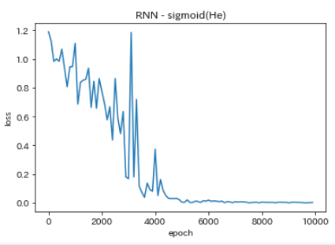
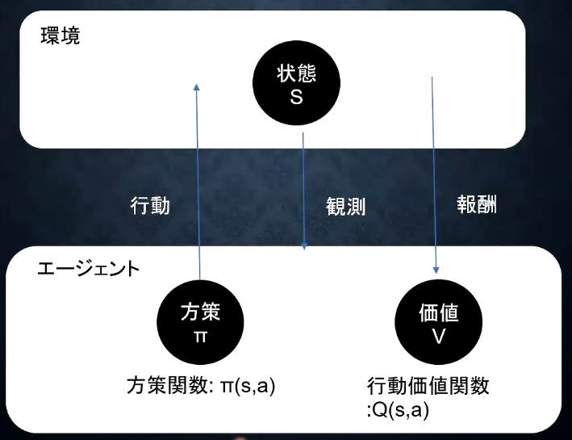
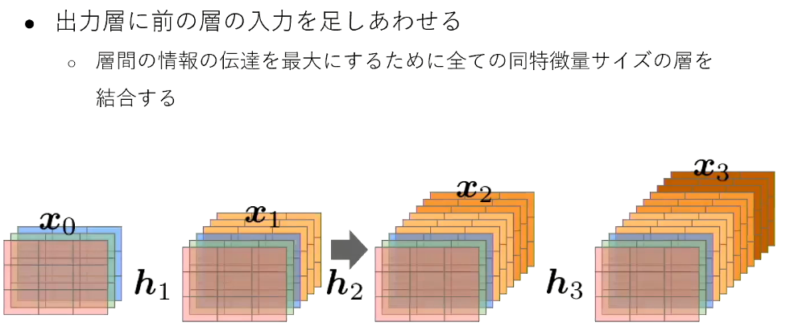

# 実装演習レポート[深層学習その２]

<script type="text/javascript" async src="https://cdnjs.cloudflare.com/ajax/libs/mathjax/2.7.7/MathJax.js?config=TeX-MML-AM_CHTML">
</script>

<script type="text/x-mathjax-config">
 MathJax.Hub.Config({
 tex2jax: {
 inlineMath: [['$', '$'] ],
 displayMath: [ ['$$','$$'], ["\\[","\\]"] ]
 }
 });
</script>

## 1.はじめに

    本レポートはrabbit challenge受講者「Manabu Kobatake」がまとめた
    深層学習day3～day4に係る実装演習レポートです。
    【無断転載禁止】

## 2.Section1:再帰型ニューラルネットワークの概念

    RNNとは、時系列データに対応可能なニューラルネットワークである。
    時系列データとは？
        時間的順序を追って一定間隔ごとに観察され、
        しかも総合に統計的依存関係が認められるデータの系列
        株価・・・時間とともに価格の高さが変動する。
        音声・・・時間とともに周波数、大きさが変動する
        テキスト・・・時間とともに文字が変わる。

RNNの数学的記述<BR>
$u_t=W_{(in)}x^t+Wz^{t-1}+b$
$※バイアスbはW_{(in)}とWの双方に対応するバイアスの合算$

```python
u[:,t+1]=np.dot(X,W_in) + np.dot(z[:,t].reshape(1,-1),W)
```

$z_t=f(W_{(in)}x^t+Wz^{t-1}+b)$

```python
z[:,t+1]=functions.sigmoid(u[:,t+1])
```

$v_t=W_{(out)}Z^t+c$

```python
v[:,t+1]=np.dot(z[:,t+1].reshape(1,-1),W_out)
```

$y_t=g(W_{(out)}Z^t+c)$

```python
y[:,t+1]=functions.sigmoid(v[:t+1])
```

    RNNの特徴とは？
        時系列モデルを扱うには、初期の状態と過去の時間t-1の状態を保持し、
        そこから次の時間でのtを再帰的に求める再帰構造が必要になる。

    RNNにおけるパラメータ調整法の一種としてBPTT(Back Propagation Through Time)
    と呼ばれるものがある。
    これは誤差逆伝播法の一種にあたる。
        
BPTTの数学的記述<BR>
$EをW_{(in)}で微分$
$\frac{\partial E}{\partial W_{(in)}} = \frac{\partial E}{\partial u^t}
\begin{bmatrix}
\frac{u^t}{W_{(in)}}
\end{bmatrix}^T
=\delta^t
\begin{bmatrix}
x^t
\end{bmatrix}^T $
$\qquad$
$右上のT\cdots 時間的にさかのぼって微分を行う、の意味$
$\frac{\partial E}{\partial u^t}=\frac{\partial E}{\partial v^t}\frac{\partial v^t}{\partial u^t}=\delta^t$

```python
    np.dot(X.T,delta[:,t].reshape(1,-1))
```

$EをW_{(out)}で微分$
$\frac{\partial E}{\partial W_{(out)}} = \frac{\partial E}{\partial v^t}
\begin{bmatrix}
\frac{v^t}{W_{(out)}}
\end{bmatrix}^T
=\delta^{out,t}
\begin{bmatrix}
z^t
\end{bmatrix}^T$

```python
    np.dot(z[:,t+1].reshape(-1,1),delta_out[:,t].reshape(-1,1))
```

$EをWで微分$
$\frac{\partial E}{\partial W} = \frac{\partial E}{\partial u^t}
\begin{bmatrix}
\frac{\partial u^t}{\partial W}
\end{bmatrix}^T
=\delta^t
\begin{bmatrix}
z^{t-1}
\end{bmatrix}^T$

```python
    np.dot(z[:,t].reshape(-1,1),delta[:,t].reshape(-1,1))
```

$Eをbで微分$
$\frac{\partial E}{\partial b}=\frac{\partial E}{\partial u^t}\frac{\partial u^t}{\partial b}=\delta^t\qquad\frac{\partial u^t}{\partial b}=1$

$Eをcで微分$
$\frac{\partial E}{\partial c}=\frac{\partial E}{\partial v^t}\frac{\partial v^t}{\partial c}=\delta^{out,t}\qquad\frac{\partial v^t}{\partial c}=1$

$\delta^{t}を求める$
$\frac{\partial E}{\partial u^t}=\frac{\partial E}{\partial v^t}\frac{\partial v^t}{\partial u^t}=
\frac{\partial E}{\partial v^t}\frac{\partial \begin{Bmatrix}W_{(out)}f(u^t)+c\end{Bmatrix}}{\partial u^t}=
f'(u^t)W_{(out)}^T\cdot \delta^{out,t}=\delta^t
$

$時系列的に1つ前の状態の\delta^{t-1}を求める$
$\delta^{t-1}=\frac{\partial E}{\partial u^{t-1}}=\frac{\partial E}{\partial u^{t}}\frac{\partial u^{t}}{\partial u^{t-1}}=\delta^t\begin{Bmatrix}\frac{\partial u^t}{\partial z^{t-1}}\frac{\partial z^{t-1}}{\partial u^{t-1}}\end{Bmatrix}=\delta^t\begin{Bmatrix}Wf'(u^{t-1})\end{Bmatrix}$

$\delta^{t-z-1}=\delta^{t-z}\begin{Bmatrix}Wf'(u^{t-z-1})\end{Bmatrix}$

```python
# Δ^t-1=(Δt^T・W^T + Δ_out^t・W_out^T)・f'(u^t)
delta[:,t]=(np.dot(delta[:,t+1].T,W.T) + np.dot(delta_out[:,t].T,W_out.T)) * functions.d_sigmoid(u[:,t+1])
```

$パラメータの更新式(いずれも学習率\epsilon をかけて減算する)$
入力層→中間層
$W_{(in)}^{t+1}=W_{(in)}^t-\epsilon\frac{\partial E}{\partial W_{(in)}}=W_{(in)}^t-\epsilon \displaystyle \sum_{z=0}^{T_t}\delta^{t-z}\begin{bmatrix}x^{t-z}\end{bmatrix}^T$

中間層→出力層
$W_{(out)}^{t+1}=W_{(out)}^t-\epsilon\frac{\partial E}{\partial W_{(out)}}=W_{(out)}^t-\epsilon\delta^{out,t}\begin{bmatrix}z^t\end{bmatrix}^T$

中間層→中間層
$W^{t+1}=W^t-\epsilon\frac{\partial E}{\partial W}=W^t-\epsilon \displaystyle \sum_{z=0}^{T_t}\delta^{t-z}\begin{bmatrix}z^{t-z-1}\end{bmatrix}^T$

バイアスb
$b^{t+1}=b^t-\epsilon\frac{\partial E}{\partial b}=b^t-\epsilon \displaystyle \sum_{z=0}^{T_t}\delta^{t-z}$

バイアスc
$c^{t+1}=c^t-\epsilon\frac{\partial E}{\partial c}=c^t-\epsilon \delta^{out,t}$

$E^t=loss(y^t,d^t)$
$\qquad=loss(g(W_{(out)}z^t+c),d^t)$
$\qquad=loss(g(W_{(out)}\underline{f(W_{(in)}x^tWz^{t-1}+b)}+c),d^t)$
$\qquad\qquad\qquad\qquad\quad\qquad\qquad\downarrow$
$\qquad\qquad\qquad\qquad\quad f(W_{(in)}x^tWz^{t-1}+b)$
$\qquad\qquad\qquad\qquad\quad\qquad\qquad\downarrow$
$\qquad\qquad\qquad\qquad f(W_{(in)}x^tWf(u^{t-1})+b)$
$\qquad\qquad\qquad\qquad\quad\qquad\qquad\downarrow$
$\qquad\qquad\qquad f(W_{(in)}x^tWf(W_{(in)}x^{t-1}+Wz^{t-2}+b)+b)$
$\qquad\qquad\qquad\qquad\quad\qquad\qquad\downarrow$
$\qquad\qquad\qquad f(W_{(in)}x^tWf(W_{(in)}x^{t-1}+Wf(u^{t-2})+b)+b)$
$\qquad\qquad\qquad\qquad\quad\qquad\qquad\vdots$
$zが時系列につながっていることを表している(再帰的)$

### 2-1.講義内容まとめ

    RNNは時系列データを取り扱うことに適したニューラルネットワークであるが、
    基本的なコンセプトそのものは通常のニューラルネットワークの概念を踏襲している。
    ただ、違うのは順伝播の際に「時系列上前回の中間層の出力」を各中間層の入力として
    学習に用いている点と、逆伝播法によってパラメータの更新量を決定づける際に
    「時系列上前回の中間層の出力」も逆伝播の対象となることである。
    いずれも時系列間のデータのつながりを再帰的に処理していくことになる。
    BPTTと呼ばれる逆伝播法の一種によりパラメータの更新量を求めることになるが、
    中間層の出力z^tを紐解いていくと過去の時系列の出力が現われる。
    ただ、非常に計算量が多く、相応のハードスペックが求められるネットワーク
    であるとの印象を受けた。

### 2-2.実装演習結果

サンプルのコードを活性化関数の変更、中間層の数を調整して実行した結果を比較
|活性化関数<BR>初期パラメータ|中間層×8|中間層×16|中間層×32|
|:-:|:-:|:-:|:-:|
|sigmoid<BR>標準偏差||||
|sigmoid<BR>Xavier|-||-|
|sigmoid<BR>He|-||-|
|ReLU<BR>標準偏差|-||-|

    【考察】
        中間層の数を増やすと収束に至るまでの時間が短くなる傾向が見て取れる。
        またパラメータ初期化方法としてXavierやHeを選択した場合も
        標準偏差で行うよりも若干収束までの時間が若干短縮される。
        なお、活性化関数にReLUを用いた場合、勾配爆発が発生しいつまでたっても収束しない。

サンプルのコードを解析し、各コードが表現している数式をコメント上に記載した。

```python
for i in range(iters_num):
    
    # A, B初期化 (a + b = d)
    a_int = np.random.randint(largest_number/2)
    a_bin = binary[a_int] # binary encoding
    b_int = np.random.randint(largest_number/2)
    b_bin = binary[b_int] # binary encoding
    
    # 正解データ
    d_int = a_int + b_int
    d_bin = binary[d_int]
    
    # 出力バイナリ
    out_bin = np.zeros_like(d_bin)
    
    # 時系列全体の誤差
    all_loss = 0    
    
    # 時系列ループ
    for t in range(binary_dim):
        # 入力値
        X = np.array([a_bin[ - t - 1], b_bin[ - t - 1]]).reshape(1, -1)
        # 時刻tにおける正解データ
        dd = np.array([d_bin[binary_dim - t - 1]])
        
        #-----------------------------------------------
        # u^t、つまり入力と前回の中間層zの合算を求める
        # u^t = X・W_in + z^t-1・W
        #-----------------------------------------------
        u[:,t+1] = np.dot(X, W_in) + np.dot(z[:,t].reshape(1, -1), W)
        #-----------------------------------------------
        # u^tを活性化関数fにかけてz^tを求める
        # z^t = f(u^t)
        #-----------------------------------------------
        z[:,t+1] = functions.sigmoid(u[:,t+1])
#         z[:,t+1] = functions.relu(u[:,t+1])
#         z[:,t+1] = np.tanh(u[:,t+1])    
        #-----------------------------------------------
        # z^tとW_outを活性化関数gにかけてy^t-1を求める
        # y^t-1 = g(z^t・W_out)
        #-----------------------------------------------
        y[:,t] = functions.sigmoid(np.dot(z[:,t+1].reshape(1, -1), W_out))


        #誤差を求める(平均二乗誤差)
        loss = functions.mean_squared_error(dd, y[:,t])
        
        #-----------------------------------------------
        # 逆伝播用にΔ_outを求める(E'(y^t-1)・g'(y^t-1))
        #-----------------------------------------------
        delta_out[:,t] = functions.d_mean_squared_error(dd, y[:,t]) * functions.d_sigmoid(y[:,t])        
        
        # 時系列分の誤差をすべて累積する
        all_loss += loss

        out_bin[binary_dim - t - 1] = np.round(y[:,t])
    
    
    for t in range(binary_dim)[::-1]:
        X = np.array([a_bin[-t-1],b_bin[-t-1]]).reshape(1, -1)        
        
        #-----------------------------------------------
        # 時系列的１つ前のΔ^t-1を求める
        # Δ^t-1 = (Δ^t・W + Δout^t-1・W_out)・f'(u^t)
        #-----------------------------------------------
        delta[:,t] = (np.dot(delta[:,t+1].T, W.T) + np.dot(delta_out[:,t].T, W_out.T)) * functions.d_sigmoid(u[:,t+1])
#         delta[:,t] = (np.dot(delta[:,t+1].T, W.T) + np.dot(delta_out[:,t].T, W_out.T)) * functions.d_relu(u[:,t+1])
#         delta[:,t] = (np.dot(delta[:,t+1].T, W.T) + np.dot(delta_out[:,t].T, W_out.T)) * d_tanh(u[:,t+1])    

        # 勾配更新
        #-----------------------------------------------
        # 出力用の重み更新量を求める（z_t・Δout_t-1）
        #-----------------------------------------------
        W_out_grad += np.dot(z[:,t+1].reshape(-1,1), delta_out[:,t].reshape(-1,1))
        #-----------------------------------------------
        # 中間層用の重み更新量を求める(z^t-1・Δ^t-1)
        #-----------------------------------------------
        W_grad += np.dot(z[:,t].reshape(-1,1), delta[:,t].reshape(1,-1))
        #-----------------------------------------------
        # 入力用の重み更新量を求める(X・Δ^t-1)
        #-----------------------------------------------
        W_in_grad += np.dot(X.T, delta[:,t].reshape(1,-1))
    
    # 勾配適用(学習率をかける)
    W_in -= learning_rate * W_in_grad
    W_out -= learning_rate * W_out_grad
    W -= learning_rate * W_grad

    # テンポラリ変数の初期化    
    W_in_grad *= 0
    W_out_grad *= 0
    W_grad *= 0
```

### 2-3.確認テスト考察結果

    ■確認テスト
        RNNのネットワークには大きく分けて3つの重みがある。
        1つは入力から現在の中間層を定義する際にかけられる重み、
        1つは中間層から出力を定義する際にかけられる重みである。
        残り1つの重みについて説明せよ。

        【回答】
            時系列上、前回の中間層から今回の中間層を定義する際にかけられる重み

    ■確認テスト
        以下は再帰型ニューラルネットワークにおいて構文木を入力として再帰的に
        分全体の表現ベクトルを得るプログラムである。
        ただし、ニューラルネットワークの重みパラメータはグローバル変数として
        定義してあるものとし、_activation関数はなんらかの活性化関数であるとする。
        木構造は再帰的な辞書で定義してあり、rootが最も外側の辞書であると仮定する。
        （く）に当てはまるのはどれか


    ■確認テスト
        下図のy1をx・z0・z1・w_in・W・W_outを用いて数式で表せ。
        ※バイアスは任意の文字で定義せよ
        ※また中間層の出力にはシグモイド関数g(x)を作用させよ。


【回答】
$z_1=f(W_{(in)}\cdot x+W\cdot z_0+b)$
$y_1=g(W_{(out)}\cdot z_1+c)$

    ■確認テスト


## 3.Section2:LSTM

    RNNの課題
        時系列を遡れば遡るほど、勾配が消失していく。
        特に長い時系列の学習が困難でRNNでは非常に起こりやすい
        　→時系列同士の積が層の扱いと同等
            0.5×0.5×...0.5
    
    解決策
        勾配消失問題自体はDNNの項で扱った方法とは異なり
        構造自体を変えて解決したのがLSTM

    勾配爆発
        勾配が層を逆伝播するごとに指数関数的に大きくなっていく現象
        この現象により学習がうまく進まない。


    CEC(Constant Error Carousel)
        RNNにおける中間層を抜き出したもの。学習機能と記憶機能を分離したときの後者をつかさどる。
        勾配消失問題および勾配爆発を解決するためには勾配が１であればよい。

        課題
            情報を覚えるだけなので学習機能がない
            時間依存度に関係なく重みが一定。
    
    入力ゲートと出力ゲート
        入力ゲート
            入力された情報をCECにどのように記憶させるかを決定する。
            今回の入力の重みWiと前回の中間層Uiをそれぞれ
            どの程度の重みづけでCECに渡すかについて
            ニューラルネットワークを用いて学習する。
            (CECへ記憶させる方法を学習する)
        出力ゲート
            CECが覚えている情報を取り出して出力を生成する際、
            そのようにCECの出力を使用するかを決定する。
            今回の出力の重みWoと前回の中間層Uoをぞれぞれ
            どの程度の重みづけでCECから取得するかについて
            ニューラルネットワークを用いて学習する。
        
    LSTMブロックの課題
        CECは、過去の情報が全て蓄積されている。
            ↓
        過去の情報が不要となっても削除できず保管され続ける。

        そこで過去の情報が不要となったタイミングで情報を破棄する機能が必要。
            ↓
        忘却ゲートの概念を追加

    忘却ゲート
        CECの中の情報をあるタイミングで破棄する。
        今回の入力の重みWfと前回の中間層Ufを基に、
        忘却すべき情報を学習する。

    覗き穴結合
        CECの保存情報を任意のタイミングで他のノードに伝播させたりあるいは忘却させたい。
        CEC自身の値は、ゲート制御に影響を与えていない。

        そこでCEC自身の値に、重み行列を介して伝播可能にした構造が考案された。
        この構造のことを「覗き穴結合」という。

        各ゲートでWやUのほかにCECの情報を判断材料として
        利用するという試みだが、大きな効果は得られない。

### 3-1.講義内容まとめ

    LSTMはRNNで発生しやすい勾配消失もしくは勾配爆発を回避するために
    構造の変更など必要な手当てを遠慮なく施したモデルと言える。
    CECと入力ゲート、出力ゲート、忘却ゲートそれぞれが担う役割が明確に分かれており、
    個々の発想そのものは比較的理解しやすい。
    しかし、理想を追いかけるあまり構造が複雑化したことでパラメータが多くなり、
    計算負荷も大きくなりすぎた。
    そのため、後述するGRUの概念が生まれた。

### 3-2.実装演習結果

    ■演習チャレンジ：勾配のノルムをしきい値に正規化するロジック


    ■演習チャレンジ：LSTMのCECからの出力c(t)を求めるロジック


### 3-3.確認テスト考察結果

    ■確認テスト


    ■確認テスト
        以下の文章をLSTMに入力し空欄に当てはまる単語を予測したいとする。
        文中の「とても」という言葉は空欄の予測において
        なくなっても影響を及ぼさないと考えられる。
        このような場合、どのゲートが作用すると考えられるか。

        「映画面白かったね。ところで、とてもお腹が空いたから何か＿＿＿＿。」

        【回答】：忘却ゲートが作業し、「とても」に関するCEC上の情報を不要なものとして破棄する。

## 4.Section3:GRU

    LSTMの課題
        LSTMではパラメータが多く、計算負荷が高くなる問題があった。
        （RNNをうまく動かしたかったがやりすぎた）

    GRU(Gated recurrent unit)
        GRUではそのパラメータを大幅に削減し、
        精度は同等またはそれ以上が望めるようになった構造
        計算負荷が低いというメリットがある。

    リセットゲートと更新ゲート
        LSTMに比べてシンプルな構造とし、計算量を減らしている。
        隠れ層の状態をh(t)として保存する。

        リセットゲート
            今回の入力Wrと前回の出力Urをもとに
            隠れ層の状態をどのように保持しておくかを決定する。→r(t)
            →前回の中間層の状態にかける
        更新ゲート
            今回の入力Wzと前回の出力Uzをもとに
            どのように出力するかを決定する。→z(t)
            →前回の中間層の状態にかける


リセットゲート出力
$\quad r(t)=W_r\cdot x(t)+U_r\cdot h(t-1)+b_h(t)$
入力＋リセットゲート出力
$\quad h(t)=f(W_r\cdot x(t)+U_r\cdot (r(t)\cdot h(t-1))b_h(t))$
更新ゲート出力
$\quad z(t)=W_z\cdot x(t)+U_z\cdot h(t-1)+b_z(t)$
GRU出力
$\quad h(t)=z(t)\cdot h(t-1)+(1-z(t))\cdot h(t)$

### 4-1.講義内容まとめ

    GRUはLSTMの課題である計算負荷が大きい点を克服した機構で、
    単純に負荷の抑制のみならず、精度の向上も見込めることが大きい。
    負荷の抑制できている理由はLSTMに比べてシンプルな構造にしたことにある。
    隠れ層をh(t)として保持し、リセットゲートにより隠れ層の状態をどう
    扱うかを決定し、更新ゲートにより出力を決定する。
    このため、LSTMよりも扱うパラメータは少なくて済む。

### 4-2.実装演習結果

    ■演習チャレンジ：GRUの最終出力h(t)を求めるロジック


### 4-3.確認テスト考察結果

    ■確認テスト
        LSTMとCECが抱える課題について、それぞれ簡潔に述べよ。
        LSTMの課題
            4つの部品がありパラメータが多すぎて計算負荷が高いこと
            
        CECの課題
            学習能力がないので各ゲートで補うこととなる。

    ■確認テスト
        LSTMとGRUの違いを簡潔に述べよ。
        LSTMはCEC,入力ゲート,忘却ゲート,出力ゲートという4つの部品から構成される。
        GRUはリセットゲート,更新ゲートの2つの部品のみで構成される。
        LSTMに比してGRUは部品の数すなわちパラメータ数が少なく、その分計算負荷も低い。


## 5.Section4:双方向RNN

    双方向RNN(Bidirectional RNN)とは
        過去の情報だけでなく、未来の情報を加味することで、
        精度を向上させるためのネットワークモデル。
        学習時に、過去と未来の情報の入力を必要とすることから、
        運用時も過去から未来までのすべての情報を入力してはじめて予測できるようになる。

    実用例
        文章の推敲や、機械翻訳等


### 5-1.講義内容まとめ

    双方向RNNは時系列上、次の時点のデータの学習に過去の中間層だけでなく、
    未来の中間層の状態も加味するというアプローチで、
    通常のRNNよりもより精度の高い結果が期待できる。
    過去と未来の中間層出力を同一セットのベクトルとして連結し
    各時点での学習に用いる。
    主に文章の推敲や機械翻訳等に用いられることが多い。
    ただし、計算量は通常のRNNよりも多くなる上、未来の情報が
    全て整った状態でないと学習ができないという制限がある。
    オンライン学習的な随時処理には不向きと感じた。

### 5-2.実装演習結果

    ■実装演習問題：双方向RNNにおける中間層出力の扱い


$数式表現：y_t=\phi\begin{pmatrix}\begin{pmatrix}\overrightarrow{H_t} \\ \overleftarrow{H_t} \end{pmatrix}W+b_y\end{pmatrix}$

### 5-3.確認テスト考察結果

    なし

## 6.Section5:Seq2Seq

    2つのネットワークをドッキングして使う自然言語用のネットワーク構成
    機械翻訳に用いられている。
    Encoder-Decoderモデルの一種。
    （時系列のデータを入力にとって、時系列のデータを出力する）


    Encoder RNN
        Taking
            文章を単語等のトークンごとに分割し、トークンごとのIDに分割する。
        Embededding
            IDから、そのトークンを表す分散表現ベクトルに変換。
        Encoder RNN
            ベクトルを順番にRNNに入力していく
            1.vec1をRNNに入力し、hidden stateを出力。
            このhidden stateと次の入力vec2をまたRNNに入力してきた
            hidden stateを出力という流れを繰り返す。

            2.最後のvecを入れたときのhidden stateをfinal stateとしてとっておく。
            このfinal stateがthought vectorと呼ばれ、入力した分の意味を表すベクトルとなる。


    Decoder RNN
        入力となった文脈のベクトル表現から対応する
        単語等のトークンごとに生成する構造
        1.Decorder RNN
            Encoder RNNのfinal state(thought vector)から、
            各tokenの生成確率を出力していく。
            final stateをDecode RNNのinitial stateとして設定し、Embeddingを入力。
        2.Sampling  
            生成確率に基づいてtokenをランダムに選ぶ
        3.Embedding
            2.で選ばれたtokenをEmbedding表現に変更し、Decode RNNの次の入力とする。
        4.Detokenize
            1-3を繰り返し、2で得られたtokenを文字列に直します。
            


|単語|ID|ベクトル(One-Hot)<BR>10,000|Embedding表現<BR>数百|
|:-:|:-:|:-:|:-:|
|私|1|[1,0,0,...0]|[0.2,0.4,0.6...0.1]|
|は|2|[0,1,0,...0]|[0.1,0.3,0.5...0.1]|
|昨日|3|[0,0,1,...0]|[0.6,0.4,0.3...0.1]|
|刺身|4|[0,0,0,1...0]|[0.9,0.7,0.1...0.1]|
|$\vdots$|$\vdots$|$\vdots$|$\vdots$|
|でした。|10,000|[0,0,0,...1]|[0.5,0.8,0.2...0.9]|

        何らかの表現からEmbedding表現を得て、同じような意味合いの
        単語を似通ったベクトル表現に近づけることが、自然言語処理における重要な課題である。

MLM-Masked Language Model
一部の単語のベクトル表現を隠し、他の隠されていない単語のベクトル表現から
隠された単語の意味合いを予測することを試みる。
|私|は|昨日|ラーメン|を|食べ|ました|
|:-:|:-:|:-:|:-:|:-:|:-:|:-:|:-:|
|$\cdots$|$\cdots$|$\cdots$|$\cdots$|$\cdots$|$\cdots$|$\cdots$|
|-|-|×|-|-|-|-|
※「昨日」という単語をマスクし、他の単語から「昨日」の部分に最適な単語を予測する

### HRED

    Seq2seqの課題
        一問一答しかできない。
        （１つの文章に対して１つの答えしかない）
        問いに対して文脈も何もなく、ただ応答が行われるづける。点だけをとらえている。
        ↓
        過去の文脈から捉えられないか（点ではなく線）

    HREDという概念
        過去n-1個の発話から次の発話を生成する。
        Seq2seqでは、会話の文脈を無視して応答していたが、
        前の単語の流れに即して応答されるため、
        より人間らしい文章が生成される。

        システム：子犬かわいいね
        ユーザ：うん
        システム：子犬かわいいのわかる

            HREDとはSeq2seq + Context RNN

    ContextRNN
        Encoderのまとめた各文章の系列にまとめて、
        これまでの会話コンテキスト全体を表すベクトルに変換する構造。
        これにより過去の発話の履歴を加味した返答ができる。

    HREDの課題
        確率的な多様性が字面にしかなく、会話の流れのような多様性がない。
        つまり同じコンテキスト（発話リスト）が与えられても
        答えの内容が毎回会話の流れとして同じものしか出せない。
        情報量が乏しく単調で短い応答になりがち。
        ex)「うん」「そうだね」「なるほど」「・・・」
        
### VHRED

    VHREDとは、VAEの潜在変数の概念を追加したもの
    （HREDの課題をVAEの製剤変数の概念を追加することで解決した構造）
    VAEのAEとはAutoEncoder（オートエンコーダ）

### オートエンコーダ（Auto Encoder）

    教師なし学習の一つ
    そのため学習時の入力データは訓練データのみで教師データは使わない。
    自己符号化器ともいう。

    オートエンコード具体例
        MMNISTの場合、28×28の数字の画像を入れて、
        同じ画像を出力するニューラルネットワーク
    
    オートエンコーダの概要
        入力データから潜在変数zに変換するニューラルネットワークをEncoder、
        逆に潜在変数zをインプットとして元画像を復元するニューラルネットワークをDecoderという。

    オートエンコーダのメリット
        次元削除が行えること。
    


### VAE

    通常のオートエンコーダの場合、
    何かしら潜在変数zにデータを押し込めているものの、
    その構造がどのような状態かは不明。
    VAEではこの潜在変数zに確率分布z~N(0,1）を仮定したもの
    （潜在変数zを求める際に正則化する。）
    VAEは、データを潜在変数zの確率分布という構造に押し込めることを可能にする。

    通常、デコーダーで復元できるような情報を潜在変数として生成する。
    例えばOne-Hot-VectorではMNISTにおける数字同士の類似度が分からない。
    元の数字の類似度に近しい値で潜在変数zが決定されてほしい。

    エンコーダ部分でノイズを加える（ドロップアウトなど）ことにより
    毎回若干異なるベクトルにし、より汎化した分散に近い情報を
    潜在変数zとして落とし込む。

### 6-1.講義内容まとめ

    seq2seqは読んで字のごとくあるRNNから生成された結果を
    別のRNNの入力として用いる、複数の構成からなるRNNである。
    前者はEncoder,後者はDecoderとして振舞う。
    イメージとしては、日英機械翻訳のように前者のEncoderにて
    日本語の文章から抽出した特徴量ベクトルを生み出し、
    後者のDecoderにてその特徴量ベクトルを入力して英語の文章に
    変換をかけていくものとなる。
    ただし単語ベースで1問1答の出力しか得られず高度な応用はできない。
    そこでHREDやVHREDのように会話の流れからより自然に近い適切な
    出力を得られるようなアプローチが考案された。
    特にVHREDで利用されるオートエンコーダの概念は非常に汎用性が高い。

### 6-2.実装演習結果

    ■演習問題:one-hotベクトルの変換


$words:\begin{bmatrix}X_{11} & \cdots & X_{1v} \\ \vdots & \ddots & \vdots \\ X_{n1} & \cdots & X_{nv} \end{bmatrix},w:\begin{bmatrix}X_{11}, \\ \vdots \\ X_{1v}\end{bmatrix}$
$E:\begin{bmatrix}E_{11} & \cdots & E_{1v} \\ \vdots & \ddots & \vdots \\ E_{e1} & \cdots & E_{ev} \end{bmatrix},e=E\cdot w$

### 6-3.確認テスト考察結果

    ■確認テスト：seq2seqについての説明
        【回答】：2


    ■確認テスト
        seq2seqとHREDとVHREDの違いを簡潔に述べよ。
            【回答】
            seq2seqは１文の１問１答に対して処理ができる、
            ある時系列データから別の時系列データを生み出す機構。

            HREDはseq2seqの機構にそれまでの文脈の意味ベクトルを解釈に加えられるようにすることで、
            文脈の意味を汲み取った分の変換・変更ができるようにしたもの。

            VHREDはHREDが当たり障りのない回答しか生み出せなくことに対する解決策。
            オートエンコーダ(VAE)の考え方を取り入れて、より自然かつ適切な
            出力を得られるように改良したもの。

    ■確認テスト
        VAEに関する下記の説明文の空欄に当てはまる文言を答えよ。
        「自己符号化器の潜在変数に＿＿＿＿を導入したもの」
        【回答】：確率分布

## 7.Section6:word2vec

    課題
        RNNでは、単語のような可変長の文字列をNNに与えることはできない。
        したがって固定長形式で単語を表す必要があった。
    
    学習データからボキャブラリを作成
        例えば7語のボキャブラリを作成した場合、
        本来は辞書の単語数だけできあがる。

        Ex)I want to eat apples. I like apples.
        ↓
        {apple,eat,I,like,to,want}
        ↓
        Applesを入力する場合は、入力層には以下のベクトルが含まれる
        ※本来は辞書の単語数だけone-hotベクトルができあがる

|辞書表現|
|:--|
|$1\cdots apples$|
|$0\cdots eat$|
|$0\cdots I$|
|$0\cdots like$|
|$0\cdots to$|
|$\vdots$|
→扱う単語の数だけOne-Hotベクトルの要素数が増えてしまう！！

    word2vecのメリット
        大規模データの分散表現の学習が
        現実的な計算速度とメモリ量で実現可能とした。
        ×：ボキャブラリ×ボキャブラリだけの重み行列が誕生
        〇：ボキャブラリ×任意の単語ベクトル次元の重み行列が誕生

        One-HotベクトルではなくEmbedding表現に変換して情報量を減らす。
        変換表を上手に機械学習によって学習させることにより、
        単語同士の意味のつながりを保ちながら、より少ない情報で表すことができる。

|潜在変数z|数式表現|特徴|
|:-:|:-:|:-:|
|ボキャブラリ×ボキャブラリ<BR>だけの重み行列|$[0,1,0,0,0,0,0,\cdots,I]$|ほぼゼロの値で構成され無駄が多い|
|ボキャブラリ×任意の単語<BR>ベクトル次元の重み行列|$\begin{bmatrix}w_{11}^{(I)} & \cdots & w_{1I}^{(I)} \\ \vdots & \ddots & \vdots \\ w_{J1}^{(I)} & \cdots & w_{JI}^{(I)}  \end{bmatrix}=[1,13,15]$|単語本来の意味を損なうことなく<BR>最低限の情報量で表現できる。|

### 7-1.講義内容まとめ

    word2vecでは、単語の意味を表す表現としてOne-Hotベクトルのような
    非常に無駄の多い情報を含むものではなく、より扱いやすい分散表現を
    取得し、情報量を抑制することを実現している。
    意味合いの近い単語同士は分散表現の値も近しくなる。
    また、これをEmbedded表現とも言い、主に自然言語処理で利用する
    RNNにおいて定番の手法として活用されている。
    （後述のTransformerでも関連する記述が見受けられる）
    なお、word2vecにおける分散表現の取得は推論ベースで行われる。

### 7-2.実装演習結果

    なし

### 7-3.確認テスト考察結果

    なし

## 8.Section7:Attention Mechanism

    seq2seqの課題
        長い文章を取り扱うのが困難
        2単語でも1000単語でも、固定次元のベクトルの中で
        表現する必要があり、長い文章になればなるほど
        固定次元のベクトルで表現しきれない恐れがある。

    解決策
        文章の長さに応じてシーケンスの内部表現の次元も大きくする、
        そのような仕組みが必要となる。
        この仕組みをAttntion Mechanismという。
        入力と出力のどの単語が関連しているか、の
        関連度を学習する仕組みといえる。
        近年のモデルで性能の高いものはすべて
        AttentionMechanismである。


### 8-1.講義内容まとめ

    AttentionMechanismについての詳しい解説は、
    後述のTransformerの節にて触れているためそちらに譲るが、
    固定次元のベクトルで各単語の状態を表現していては、
    文章の長さによって精度を一定に保てないという課題がある。
    これを解決するための手法として、AttentionMechanismの
    概念が生み出された。
    元の文章の長さに応じて次元を自由に制御し、なおかつ入出力
    間で単語の関連性を辞書オブジェクトの機構により表現することで
    より自然かつ説明しやすい結果を得ることができるようになる。


### 8-2.実装演習結果

    なし

### 8-3.確認テスト考察結果

    ■確認テスト
        RNNとword2vec、seq2seqとAttentionMechanismの違いを簡潔に述べよ。

        【回答】
            RNNとは時系列データを取り扱うのに適したニューラルネットワークである。

            word2vecは単語の分散表現を得る手法である。

            seq2seqは1つの時系列データから別の時系列データを得るニューラルネットワークである。

            時系列のデータの中身の入出力間の関連に重みを付ける手法である。

## 9.Section1:強化学習

    強化学習とは、長期的に報酬を最大化できるように
    環境の中で行動を選択できるエージェントを作ることを
    目標とする危害学習の一分野である。

    行動の結果として与えられる利益(報酬)をもとに
    行動を決定する原理を改善していく仕組みです。

    ・教師あり学習/教師なし学習
        人間が成長とともに自然と得ていく知能、能力

    ・強化学習
        (仕事を)自力で試行錯誤しながら覚えていくスキル



    エージェントがより多くの報酬を得るために方策を生み出す。
    その結果環境の状態が変化しそれを観測する。
    環境の状態変化により相応の報酬を環境から得ることができる。

    ・強化学習の応用例
        マーケティングの場合
        環境：会社の販売促進部

        エージェント：プロフィールと購入履歴に基づいて、
        キャンペーンメールを送る顧客を決めるソフトウェア。

        行動：顧客ごとに送信、非送信の二つの行動を選ぶことになる。

        報酬：キャンペーンのコストという負の報酬と
        キャンペーンで生み出されると推測される売上という正の報酬
            →正の報酬の最大化＆負の報酬の最小化

        報酬を最適化するために、よりより方策を生み出すことを目的とする。


    ・探索と利用のトレードオフ
        環境について事前に知識があれば、
        最適な行動を予測し決定することは可能。
            どのような顧客にキャンペーンメールを送信すると、
            どのような行動を行うのかが既知である。
            ↓↓↓
            強化学習の場合、上記仮定は成り立たないとする。
            不完全な知識をもとに行動しながら、データを収集。
            最適な行動を見つけていく。

        過去のデータで、ベストとされる行動のみを常に取り続ければ
        他にもっとベストな行動を見つけることはできない。
            （探索が足りない状態）
                ↑↑↑
            トレードオフの関係
                ↓↓↓
        未知の行動のみを常に取り続ければ、過去の経験が活かせない。
            （利用が足りない状態）

強化学習の数学的表現
$方策関数：\pi(s,a)$
$行動価値関数：Q(s,a)$

    強化学習と「教師あり学習・教師なし学習」の違い
    結論：目標が違う
        ・教師あり学習、教師なし学習では、データに含まれるパターンを見つけ出す。
        　およびそのデータから予測することが目標
        ・強化学習では、優れた方策を見つけることが目標

    強化学習について
    ・冬の時代があったが、計算速度の進展により大規模な状態をもつ場合の
    　強化学習を可能としつつある。
    ・関数近似法と、Q学習を組み合わせる手法の登場

    Q学習
    ・行動価値関数を、行動するごとに更新することにより学習を進める方法

    関数近似法
    ・価値関数や方策関数を関数近似する手法のこと

    価値関数とは
    ・価値を表す関数としては、状態価値関数と行動価値関数の2種類がある。
        ある状態の価値に注目する場合は、状態価値関数
        状態と価値を組み合わせた価値に注目する場合は行動価値関数
        Q学習では後者の行動価値関数を用いる。
    
    行動価値関数と状態価値関数の違い
        エージェントは何を目標に頑張るのか？
        状態価値関数or行動価値関数

        状態価値関数：環境の状態だけが価値を決める対象。エージェントの方策は無関係
        行動価値関数：状態とエージェントの行動の組み合わせが価値を決める対象
    
    方策関数(π(s,a))
        方策ベースの今日が学習手法において、
        ある状態でどのような行動をとるのかの確率を与える関数
        価値関数が出してくる価値を最大化する方策を生み出す。

$方策関数:\pi(s)=a$
$関数の関係$
$\quadエージェントは方策に基づいて行動する$
$\pi(s,a):状態関数Vや行動価値関数Qを基にどういう行動をとるか$
$\qquad \rightarrow 経験を活かす or チャレンジする など$
$\qquad \rightarrow その瞬間、その瞬間の行動をどうするか$

$V^{\pi}(s):状態関数$
$Q^{\pi}(s,a):状態+行動関数$
$\qquad \rightarrow ゴールまで今の方策を続けたときの報酬の予測値が得られる$
$\qquad \rightarrow やり続けたら最終的にどうなるか$

$方策反復法$
$\qquad 方策をモデル化して最適化する手法$
$方策勾配法 \quad \pi(s,a|\theta)$
$\qquad \theta^{(t+1)}=\theta^{(t)}+\epsilon \nabla J(\theta)$
$\qquad 報酬の最大化を目指すため、プラスで加算している$
$\qquad J=方策の良さ(NNでは誤差関数、ここでは期待収益)$
$\qquad \rightarrow 定義しなければならない$
$定義方法$
$\qquad \cdot 平均報酬和$
$\qquad \cdot 割引報酬和$

$上記の定義に対応して、行動価値関数:Q(s,a)の定義を行い、方策勾配定理が成り立つ$
$\nabla_{\theta}J(\theta)=\mathbb E_{\pi \theta}[(\nabla_{\theta}\log \underline{\pi_{\theta}(a|s)Q^{\pi}(s,a)})]$
$\quad$
$元の式：\nabla_{\theta}J(\theta)=\nabla_{\theta} \displaystyle \sum_{a \isin A} \underline{\pi_{\theta}(a|s)Q^{\pi}(s,a)}$
$\qquad \qquad \qquad \qquad \qquad \qquad \qquad \downarrow ある行動をとるときの報酬$

### 9-1.講義内容まとめ

    強化学習はこれまで学習してきた教師あり学習、教師なし学習と異なり、
    学習データに正解を求めるのではなく、目的として設定された報酬の
    最大化をするための行動を学習する手法である。
    囲碁・将棋といった盤面を用いるゲームの勝ち手や自動運転における
    状況判断の学習に用いられている。
    数学的表現として行動価値関数、方策関数があり、前者は状態と行動の
    組み合わせで価値を決定するもので、後者はその価値を最大化するために
    最適な行動（方策）を決定する。
    方策勾配法を用いて最適値を求めるが、通常のニューラルネットワーク同様
    勾配を求めて最適解を目指す方法論は同一。    
    ただし、報酬の最大化を目指すため加算する。


### 9-2.実装演習結果


### 9-3.確認テスト考察結果


## 10.Section2:Alpha Go

    Alpha Goには以下の2種類が存在する
        １．Alpha Go Lee
        ２．Alpha Go Zero

    まず、Alpha Go Leeについての説明

### PolicyNet(方策関数のニューラルネットワーク)


### 48チャンネルの内訳

|特徴|チャンネル数|説明|
|:--|:-:|:-:|
|石|3|自石、敵石、空白の3チャンネル|
|ALL1|1|全面1|
|着手履歴|8|8手前までに石が打たれた場所|
|呼吸点|8|該当の位置に石がある場合、<BR>その石を含む連の呼吸点の数|
|取れる石の数|8|該当の位置に石を打った場合、<BR>取れる石の数|
|取られる石の数|8|該当の位置に石を打たれた場合、<BR>取られる石の数|
|着手後の呼吸点の数|8|該当の位置に石を打った場合、<BR>その石を含む連の呼吸点の数|
|着手後にシチョウ<BR>で取れるか|1|該当の位置に石を打った場合、<BR>シチョウで隣接点を取れるかどうか|
|着手後にシチョウ<BR>で取られるか|1|該当の位置に石を打たれた場合、<BR>シチョウで隣接点を取れるかどうか|
|合法手|1|合法手であるかどうか|
|ALL0|1|全面0|
|手番|1|現在の手番が黒番であるか？<BR>(PolicyNetにはなくValueNetのみ)|

### ValueNet(行動価値関数のニューラルネットワーク)


### RollOutPolicy(教師あり学習)


    １．PolicyNetの教師あり学習
        KGS Go Server(ネット囲碁対局サイト)の棋譜データから3000万局面分の教師を用意し、
        教師と同じ着手を予測できるよう学習を行った。

        具体的には、教師が着手した手を1とし残りを0とした19×19次元の配列を
        教師とし、それを分類問題として学習した。

        この学習で作成したPolicyNetは57%程度の精度である。
    
    ２．RollOutPolicyの教師あり学習
        24%程度の精度   

    ３．強化学習によるPolicyNetの学習
        現状のPolicyNetとPolicyPoolからランダムに選択されたPolicyNetと
        対局シミュレーションを行い、その結果を用いて方策勾配法で学習を行った。

        PolicyPoolとは、PolicyNetの強化学習の過程を500Iterationごとに
        記録し、保存したものである。

        現状のPolicyNet同士の対局ではなく、PolicyPoolに保存されているものとの
        対局を使用する理由は、対局に幅を持たせて過学習を防ごうというのが主である。

        この学習をmini batch size 128で1万回行った。

    ４．強化学習によるValueNetの学習

        PolicyNetを使用して対局シミュレーションを行い、その結果の勝敗を
        教師として学習した。
        教師データ作成の手順は

        １．まずSL PolicyNet(教師あり学習で作成したPolicyNet)でN手まで打つ。
        ２．N+1手目の手をランダムに選択し、その手で進めた局面をS(N+1)とする。
        ３．S(N+1)からRL PolicyNet(強化学習で作成したPolicyNet)で終局まで打ち、
        　　その勝敗報酬をRとする。

        S(N+1)とRを教師データ対とし、損失関数を平均二乗誤差とし、回帰問題として学習した。

        この学習をmini batch size 32で5000万回おっこなった。

        N手までとN+1手からのPolicyNetを別々にしてある理由は、過学習を防ぐためであると論文では説明されている。

    モンテカルロ木探索
        囲碁ソフトでは現在最も有効とされる探索法。
        価値関数を学習させるときにどのように学習させるかを決める手法

    Alpha Go LeeとAlpha Go Zeroの違い
        １．教師あり学習を行わず、強化学習のみで作成
        ２．特徴入力からヒューリスティックな要素を排除し、石の配置のみにした
        ３．PolicyNetとValueNetを１つのネットワークに統合した
        ４．Residual Net(後述)を導入した
        ５．モンテカルロ木探索からRollOutシミュレーションをなくした

### ALpha Go ZeroのPolicyValueNet


    Residual Networkとは
        ネットワークにショートカット構造を追加して、
        勾配の爆発・消失を抑える効果を狙ったもの
        ネットワークの深さを抑えるルートができるので
        勾配爆発・消失が起きにくくなる

        Residual Networkを使うことにより、
        100層を超えるネットワークでの安定した学習が可能となった。

        基本構造は
        「Convolution」→「BatchNorm」→「ReLU」→「Convolution」→「BatchNorm」
        →「Add」→「ReLU」のBlockを1単位にして積み重ねる形となる

        また、Resisual　Networkを使うことにより層数の違うNetworkの
        アンサンブル効果が得られているという説もある。


    ResidualBlockの工夫
        Bottleneck
            1×1KernelのConvolutionを利用し、1層目で次元削除を行って
            3層目で次元を復元する3層構造にし、2層のものと比べて
            計算量はほぼ同じだが1層増やせるメリットがある、としたもの
        PreActivation
            ResidualBlockの並びをBatchNorm→ReLU→
            Convolution→BatchNorm→Relu→Convolution→Add
            とすることにより性能が上昇したものとする
    
    Network構造の工夫
        WideResNet 
            FonvolutionのFilter数をk倍にしたResNet。
            1倍→k倍xブロック→2*k倍yブロックと段階的に
            幅を増やしていくのが一般的。
            Filter数を増やすことにより、浅い層でも深い層数と
            同等以上の精度となり、またGPUをより効率的に
            使用できるため学習も早い。
        PyramidNet
            WideResNetで幅が広がった直後の層に過度の負担がかかり
            精度を落とす原因となっているとし、
            段階的にではなく各層でFilter数を増やしていくResNet。

    Residual Networkの性能
        下記表はResidualNetworkをImageNetの画像分類に使った時の
        ネットワーク構造、およびエラーレートである。
        18、34Layerのものは基本形、50、101、152LayerのものはBottleneck構造である。
            性能は従来のVGG-16と比較してTop5で4%程度もエラー率の低減に成功している。


### 10-1.講義内容まとめ

    Alpha GoについてはAI界隈のニュースで知っていた程度であり、
    詳しい内容は今回の学習により詳しく知ることができた。
    囲碁の盤面を二次元のデータとして捉え、CNNにより畳みこんで
    バッチ正規化、ReLUを介す様はこれまで学んだ内容から外れるものではなく、
    画像認識で利用されるCNNを応用していることが伺えた。
    また、Alpha Go Leeで用いられたヒューリスティックな情報を排した
    Alpha Go Zeroで精度がむしろ向上したことにより、
    人間が必要と判断して付加した情報はほとんど寄与していないことが
    非常に意外だった。

## 11.Section3:軽量化・高速化技術

    分散深層学習とは
        ・深層学習は多くのデータを使用したり、パラメータ調整のために
        　多くの時間を使用したりするため、高速な計算が求められる。
        ・複数の計算資源(ワーカー)を使用し、並列的にニューラルネットワークを
        　構成することで、効率の良い学習を行いたい。
        ・データ並列化、モデル並列化、GPUによる高速技術は不可欠である。
        ・コンピュータの進化よりもモデルの複雑化の速度が速い。
            コンピュータ：24ヶ月で2倍    
            モデル：12ヶ月で10倍

        ３－１．データ並列
            ・ワーカーと呼ばれる複数のコンピュータを準備し、
            　親となるコンピュータからそれぞれのワーカーに対して
            　モデルをコピーし、演算対象の分割されたデータを渡す。
            　（定型作業を人海戦術で行うイメージ）


            ・同期型
                各ワーカーの計算がすべて完了するのを待つ。
                それぞれ計算された勾配から平均を計算し、親モデルのパラメータを更新する。
                パラメータ更新後のモデルワーカーに再度配布する。


            ・非同期型
                各ワーカーの計算を待たずに、それぞれの子モデルごとに更新を行う。
                学習が終わった子モデルはパラメータサーバにPushされる。
                新たに学習を始めるときはパラメータサーバからPopしたモデルに対して学習していく。
                待ち時間がないので早いが、最新モデルのパラメータを利用できるとは限らない。


            同期型と非同期型の比較
                ・処理のスピードは、ワーカー間で計算を待たない非同期型の方が早い。
                ・非同期型は最新のモデルのパラメータを利用できないので、学習が不安定になりやすい。
                    ->Stale Gradient Problem
                ・現在は同期型の方が精度が良いことが多いので、主流となっている。

        ３－２．モデル並列
            ・親モデルを各ワーカに分割し、それぞれのモデルを学習させる。
            ・縦方向、横方向どちらの分割もあり得るが、
            　現在は横方向（分岐されたネットワークごと）に
            　並列化する方法が主流


        ３－３．GPU
            ・GPGPU(General-purpose on GPU)
                元々の使用目的であるグラフィック以外の用途で使用されるGPUの総称
                ・CUDA（NVIDIA社が開発）
                    DeepLearing用に提供されており使いやすい。
                    DeepLearningフレームワーク(Tensorflow,Pytorch)内で実装されているので、
                    使用する際は指定すればよい。

            ・CPU
                高性能なコアが少数
                複雑で連続的な処理が得意
                （少数精鋭主義：12～24ヶ月進化にかかる）
            ・GPU
                比較的低性能なコアが多数
                簡単な並列処理が得
                ニューラルネットの学習には単純な行列計算が多いので、高速が可能。
                （凡庸な一般労働者だが、労働集約可能）

        ３－４．量子化(Quantization)
            ネットワークが大きくなると大量のパラメータが必要となり
            学習や推論に多くのメモリと演算処理が必要

            通常のパラメータの64bit浮動小数点を32bitなど
            下位の精度に落とすことでメモリと演算処理の削減を行う。
            （メモリを多く使う理由は重みパラメータの数。VGG-16やBERT)
                例)0.1563という数字を表すのに...
                    64bit(倍精度)→8byte
                    32bit(単精度)→4byte
                    16bit(半精度)→2byte
                        →半分になる


            量子化の利点と欠点
                利点
                    計算の高速化
                    省メモリ化
                欠点
                    小数の精度の低下

            精度の低下
                16bit(半精度)で十分なことが多い

        ３－５．蒸留
            精度の高いモデルはニューロンの規模が大きなモデルになっている。
            そのため、推論に多くのメモリと演算処理が必要
            ↓
            規模の大きなモデルの知識を使い軽量な
            モデルの作成を行う。

            モデルの簡約化
                学習済みの精度の高いモデルの知識を軽量なモデルへ継承させる。

                知識の継承により、軽量でありながら複雑なモデルに匹敵する
                精度のモデルを得ることが期待できる。


    教師モデルと生徒モデル
        蒸留は教師モデルと生徒モデルの２つで構成される
            教師モデル
                予測精度の高い、複雑なモデルやアンサンブルされたモデル

            生徒モデル
                教師モデルを基に作られる軽量なモデル


        ３－６．プルーニング
            ネットワークが大きくなると大量のパラメータとなるが
            全てのニューロンの計算が制度に寄与しているわけではない。
            ↓
            モデルの精度に寄与が少ないニューロンを削減することで
            モデルの軽量化・高速化が見込まれる。


            ニューロンの削減
                ニューロンの削減の手法は重みが閾値以下の場合
                ニューロンを削減し再学習を行う。
                下記の例は重みが0.1以下のニューロンを削減した。


            ニューロン数と精度
                下記の表はOxford 102 category ower datasetを
                CafeNetで学習したモデルのプルーニングの閾値による
                各層と全体のニューロンの削減率と精度をまとめた
                ものになる。
                αは閾値のパラメータ、閾値は各層の標準偏差σとパラメータの積
                閾値を高くするとニューロンは大きく削減できるが精度も減少する
                （ただし、そこまで致命的な精度の減少ではない）


    モデルの軽量化のまとめ
        量子化：重みの精度を下げることにより計算の高速化と省メモリ化を行う技術

        蒸留：複雑で精度の良い教師モデルから軽量な生徒モデルを効率よく学習を行う技術

        プルーニング：寄与の少ないニューロンをモデルから削除し計算の高速化と省メモリ化を行う技術

### 11-1.講義内容まとめ

    深層学習モデルを学習・推論により活用していくうえで
    実用上避けて通れない問題が処理速度であるが、
    既に軽量化・高速化の手法が確立されている。
    分散深層学習などは複数のワーカーでモデルやデータを分割して
    並列で進める手法であり、Apache Sparkなどで実現可能である。
    また、GPUを活用することによりCPU以上の高速化も図れる。
    量子化は重みの精度を許容範囲内まで落として重みの記憶量を抑えること
    により省メモリ化および計算の高速化が期待できる。
    蒸留は優れた教師モデルからより軽量化された生徒モデルを構築し、
    効率よく学習させる方法で、
    他にもプルーニングと呼ばれる寄与率の少ないニューロンをモデルから
    削除するのも効果が高い。
    プルーニングは次元削除のアプローチに近いと考えられる。
        

## 12.Section4:応用モデル

    ・MobileNets：Efficient Convolutional Neural Networks for Mobile Vision Applications
        画像認識モデルは2017年ごろに完成
        ディープラーニングモデルの軽量化・高速化・高精度化を実現
        Depthwise ConvolutionとPointwise COnvolutionの
        組み合わせで軽量化を実現


    Depthwise Convolution


    Pointwise COnvolution
    


        MobileNetのアーキテクチャ
            Depthwise Separatable Convolution という手法を用いて計算量を削減している。
            通常の畳み込みが空間方向とチャネル方向の計算を同時に行うのに対して、
            Depthwise Separatable ConvolutionではそれらをDepthwise Convolutionと
            Pointwise Convolutionと呼ばれる演算によって個別に行う。 

            Depthwise Convolutionはチャネル毎に空間方向へ畳みこむ。すなわち、
            チャネル毎にD_k×D_k×1のサイズのフィルターをそれぞれ用いて計算を行うため、
            その計算量は（H×W×K×K×C×1）となる。
            ※フィルター数Mは1

            次にDepthwise Convolutionの出力をPointwise Convolutionによって
            チャネル方向に畳みこむ。
            すなわち、出力チャネル毎に1×1×Mサイズのフィルターをそれぞれ用いて
            計算を行うため、その計算量は（H×W×1×1×C×M）
            ※カーネルのサイズKは1


    ・DenseNet(画像認識モデル)
        Dense Convolution Network(以下DenseNet)は畳み込み
        ニューラルネットワーク（以下、CNN）アーキテクチャの一種である。
        ニューラルネットワークでは層が深くなるに連れて、学習が
        難しくなるという問題があったが、Residual Network（以下、ResNet）
        などのCNNアーキテクチャでは前方の層から後方の層へアイデンティティ
        接続を介してパスを作ることで問題を対処した。
        DenseBlockとよばれるモジュールを用いた、DenseNetも
        そのようなアーキテクチャの１つである。


    DenseBlockの中では少しずつチャネルが増加する。
    レイヤーを1つずつ通過するごとにチャネルが追加される。
    （Skip Connection）



    前スライドで計算した出力に入力特徴マップを付け加える。
    入力特徴マップのチャネル数がl×kの場合、出力は(l+1)×kとなる。

$第l層の出力をx_lとすると...$
$x_l=H_l([x_0,x_1,\cdots,x_{l-1}])$    


    kをネットワークのgrowth rateと呼ぶ
        kが大きくなるほど、ネットワークが大きくなるため、
        小さな整数に設定するのがよい
|入力|出力|
|:--|:--|
|$k_0$|$k$|
|$k_0+k$|$k$|
|$k_0+2k$|$k$|
|$k_0+3k$|$k$|
|$k_0+4k$|$k$|

    Transition Layer
        ・CNNでは中間層でチャネルサイズを変更する。
        ・特徴マップのサイズを変更し、ダウンサンプリングを行うため、
        　Transition Layerと呼ばれる層でDense Blockをつなぐ。
        　これにより各ブロックで特徴マップのサイズは同一となる。

    DenseNetとResNetの違い
        DenseNetは前方の各層からの出力全てが後方の層への入力として用いられる。
        ResNetは直前の層の入力のみ後方の層へ入力

        DenseBlockには成長率(Growth Rate)と呼ばれるハイパーパラメータが存在する。
        DenseBlock内の各ブロックごとにk個ずつ特徴マップのチャネル数が
        増加していくとき、kを成長率と呼ぶ。


    BatchNorm(バッチ正規化)
        ・レイヤー間を流れるデータの分布を、ミニバッチ単位で
        　平均が０、分散が１となるように正規化
        ・Batch Normalizationはニューラルネットワークにおいて
        　学習時間の短縮や初期値への依存低減、過学習の抑制などの効果がある。
        ・Batch Sizeが小さい条件下では、学習が収束しないことがあり、
        　代わりにLayer Normalizationなどの正規化手法が使われる
        　ことが多い
            (CPU、GPUなど環境に応じてサイズを変更する必要がある)
        ・H×W×CのサンプルがN個あった場合に、N個の同一チャネルが正規化の単位
        　RGBの3チャネルのsampleがN個の場合は、それぞれのチャネルの平均と分散を
        　求め正規化を実施。
        　チャネルごとに正規化された特徴マップを出力


    Layer Norm
        ・それぞれのsampleのすべてのpixelsが同一分布に従うよう正規化
        ・N個のsampleのうち１つに注目。H×W×Cの全てのpixelが正規化の単位 (チャンネルの違いは無視)
        ・RGBの3チャネルのsampleがN個の場合は、あるsampleを取り出して
        　全てのチャネルの平均と分散を求め正規化を実施。
        　特徴マップ毎に正規化された特徴マップを出力。
        ・ミニバッチの数に依存しないので、上記の問題を解消できていると考えられる。
        ・入力データや重み行列に対して、以下の操作を施しても、
        　出力が変わらないことが知られている。
        　・入力データのスケールに関してRobust（堅牢）
        　・重み行列のスケールやシフトに関してRobust（堅牢）


    InstanceNorm
        ・各sampleの各チャネルごとに正規化
            →BatchNormalizationのバッチサイズが1の場合と等価
        ・コントラストの正規化に寄与・画像のスタイル転送やテクスチャ合成タスクなどで利用


    WaveNet（音声生成モデル）
        ・生の音声波形を生成する深層学習モデル
        ・Pixel CNNを音声に応用したもの
        ・時系列データに対して畳み込み（Dilated Convolution）を適用する。　
        Dilated Convolution
        　・層が深くなるにつれて畳みこむリンクを離す（スキップ）
        　・受容野を簡単に増やすことができるという利点がある。
        　　（Dilated=1,2,4,8）


    深層学習を用いて結合確率を学習する際に、効率的に学習が行える
    アーキテクチャを提案したことがWaveNetの大きな貢献の１つである。
    提案された新しいConvolution型アーキテクチャは、
    「Dilated causal convolution」と呼ばれ、
    結合確率を効率的に学習できるようになっている。

    Dilated causal convolutionを用いた際の大きな利点は、
    単純なConvolution Layerと比べてパラメータ数に対する
    受容野が広いことである。
    （長い範囲のデータをうまく使いたい）

### 12-1.講義内容まとめ

    深層学習モデルの応用方法について大きく４つのモデルをベースに学習を進めた。
    まずはMobile Net。2017年ごろに画像認識モデルはほぼ完成形に
    到達しているため、今度はそれをより高速に・軽く・高精度に
    利用する手法を編み出された。
    これはDepthwise separatable ConvolutionとPointwise Convolutionと
    呼ばれる２つの試みにより、畳み込み時のデータ量を低減しつつ
    精度を損なわない出力を得られる。
    片やチャネルを1枚に限定する方法、片やカーネルのサイズを1×1に限定する方法で
    データ量の低減効果は理解できるものの精度が悪化しない理由については
    不明だが、実証結果が効果の期待できるものであることは確か。
    DenseNetもDenseBlock内で学習の精度を向上するために前層までの出力を
    無駄なく利用し、Pooling処理にて膨らんだ情報を元のチャネル数に戻すという
    手法を取っているが、逆に言えばそれだけ寄与率の乏しい情報が多いということが言える。
    バッチ正規化についても万能ではなく、環境要因などにより効果が乏しいこともあり
    バッチサイズに左右されない正規化の手法としてLayerNormやInstanceNormが考案されている。

## 13.Section5:Transformer

    TransformerとはEncoder-Decoderモデルに
    Attentionの概念を組み込んだものである。

    おさらい
        Encoder RNN:翻訳元の分を読み込み、実数値ベクトルに変換
        Decoder RNN:実数値ベクトルから、翻訳先の言語の文を生成

長い文章になるほど、固定長ベクトルに集約した際に
欠落する情報量が多くなるため不利になる。


    Attention(注意機構)
        翻訳先の各単語を選択する際に、翻訳元の文中の各単語の隠れ状態を利用

翻訳元の各単語の隠れ状態の加重平均
$c_i=\displaystyle \sum_{j=1}^{T_x} \alpha_{ij}h_j\cdot$

重み(全て足すと1) 重みはFFNNで求める
$\alpha=\frac{\exp(e_{ij})}{ \sum_{k=1}^{T_x}\exp(e_{ik})} ,$
$e_{ij}=a(s_{i-1},h_j)$


    Attentionは辞書オブジェクト
        query(検索クエリ)に一致するkeyを索引し、対応するvalueを取り出す操作
        であると見なすことができる。辞書オブジェクトの機能と同じ。

$\sigma$(query$\leftarrow$k2) $\rightarrow$ v2
|key|value<BR>Attention weight|
|:-:|:-:|
|k1|v1|
|k2|v2|
|k3|v3|
|k4|v4|


### Trnasformer(Vaswani et al., 2017)

    Attention is all you need.
        - 2017年6月に登場
        - RNNを使わない
        - 必要なのはAttentionだけ
        - 当時のSOTAをはるかに少ない計算量で実現
        - 英仏(3600万文)の学習を8GPUで3.5日で完了


### Position-Wise Feed-Forward Networks

位置情報を保持したまま順伝播させる

- 各Attention層の出力を決定
    2層の全結合NN
    線形変換→ReLU→線形変換

$FFN(x)=max(0,xW_1+b_1)W_2+b_2$
$W_1 \isin \mathbb{R}^{512\times 2048} \quad b_1 \isin \mathbb{R}^{2048} $
$W_2 \isin \mathbb{R}^{2048\times 512} \quad b_2 \isin \mathbb{R}^{512} $

### Scaled dot product attention

全単語に関するAttentionをまとめて計算する

$次元に応じてスケーリング$
$Attention(Q,K,V)=sofftmax(\frac{QK^T}{\sqrt{d_k}})V$

$\begin{bmatrix}q_1 \\q_2 \\ q_3 \end{bmatrix}=
\begin{bmatrix}k_1 & k_2 & k_3 \end{bmatrix}=
\begin{bmatrix}
q_1\cdot k_1 & q_1\cdot k_2 & q_1\cdot k_3 \\
q_2\cdot k_1 & q_2\cdot k_2 & q_2\cdot k_3 \\
q_3\cdot k_1 & q_3\cdot k_2 & q_3\cdot k_3 \\
\end{bmatrix}$
$\quad Q \qquad \qquad K$

$
\begin{bmatrix}
0.1 & 0.2 & 0.7 \\
0.4 & 0.3 & 0.3 \\
0.8 & 0.1 & 0.1 \\
\end{bmatrix}
\begin{bmatrix}
v_1 \\
v_2 \\
v_3 \\
\end{bmatrix}=
\begin{bmatrix}
0.1v_1 + 0.2v_1 + 0.7v_1 \\
0.4v_2 + 0.3v_2 + 0.3v_2 \\
0.8v_3 + 0.1v_3 + 0.1v_3 \\
\end{bmatrix}
$
$softmax(QK) \qquad V$


### Multi-Head attention

重みの異なる8個のヘッドを使用

- 8個のScaled Dot-Product Attentionの出力をCancat

- それぞれのヘッドが異なる種類の情報を収集


### Decoder

- Encoderと同じく6層
    各層で2種類の注意機構
    注意機構の仕組みはEncoderと同じ

- 自己注意機構
    生成単語列の情報を収集
        直下の層の出力へのアテンション
    未来の情報を見ないようにマスク

- Encoder-Decoder Attention
    入力分の情報を収集
        Encoderの出力へのアテンション

- Add(Residual Connection)
    入出力の差分を学習させる
    実装上は出力に入力をそのまま加算するだけ
    効果：学習・テストエラーの低減

- Norm(Layer Normalization)
    各層においてバイアスを除く活性化関数の入力を平均0、分散1に正則化
    効果：学習の高速化

### Position Encoding

RNNを用いないので単語列の語順情報を追加する必要がある

- 単語の位置情報をエンコード
    $PE_{(pos,2i)}=\sin\begin{pmatrix}\frac{pos}{10000^{2i/512}}\end{pmatrix}$
    $PE_{(pos,2i+1)}=\cos\begin{pmatrix}\frac{pos}{10000^{2i/512}}\end{pmatrix}$


### 13-1.講義内容まとめ

    TransformerはEncoder-Decoderモデルのネットワークだが
    RNNを使用せずAttentionの概念を中心に成り立っている点が特徴的である。
    Encoder、Decoder共にRNNでは保持できていた時系列情報の代わりに
    位置情報を付与するPositionEncodingのユニットが入口に組み込まれている。
    その後続には全単語に関するAttentionをまとめて計算するScaled dot Product Attentionが複数束ねられた
    Multi-Head Attentionのユニットがある。
    これは入出力共に線形変換された値となる。
    さらにEncoderの場合はPosition-Wise Feed-Forward Networksにて位置情報を保持したまま
    順伝播させるユニットが続く。
    Decoder側には未来の単語をカンニングさせないようマスクする自己注意機構と、
    Encoder側の出力とDecoder側の入力を基に結果を出力するソース・ターゲット注意機構が存在する。
    複数のユニットから構成されるため複雑な印象はあるが、RNNのように計算量と記憶量が膨らむものではない。
    Attentionと呼ばれる翻訳元の各単語の重みの加重平均を
    求める概念がTransformerの肝と言える。

### 13-2.実装演習結果

Attentionの有無による各seq2seqモデルのBLEU比較

```python
# Attentionを用いないseq2seqモデルの実行結果
src: is there any hope of his success ?
tgt: 彼 の 成功 の 見込み は あ り ま す か 。
out: 彼 の 成功 が 成功 する の で す か 。

src: show your own business .
tgt: 自分 の 事 を しろ 。
out: 自分 の 自分 の <UNK> を し 。

src: he lived a hard life .
tgt: 彼 は つら い 人生 を 送 っ た 。
out: 彼 は 辛 生活 を 送 っ た 。

# BLEUの出力
17.6073276538058
```

```python
# Attentionを用いたseq2seqモデル(Transformer)の実行結果
src: is there any hope of his success ?
tgt: 彼 の 成功 の 見込み は あ り ま す か 。
out: 彼 の 成功 の 望み は あ る の で す か 。

src: show your own business .
tgt: 自分 の 事 を しろ 。
out: 君 の 商売 を <UNK> に し て い っ た 。

src: he lived a hard life .
tgt: 彼 は つら い 人生 を 送 っ た 。
out: 彼 は 一生 懸命 に 暮ら し た 。

src: i study english every day .
tgt: 私 は 毎日 英語 の 勉強 を する 。
out: 私 は 毎日 英語 を 勉強 し ま す 。

# BLEUの出力
24.506523871995793
```

【考察】
Attentionを用いていない場合、断片的な表現になっているが、
Attentionを用いると、文章としての構成が自然な印象を受ける。

## 14.Section6:物体検知・セグメンテーション

|タスク|出力|難易度|
|:-:|:-:|:-:|
|分類|(画像に対し単一または複数の)<BR>クラスラベル|物体の位置不要|
|物体検知|Bounding Box<BR>(bbox/BB)|インスタンスの区別不要|
|意味領域<BR>分割|(各ピクセルに対し単一の)<BR>クラスラベル|インスタンスの区別不要|    
|個体領域<BR>分割|(各ピクセルに対し単一の)<BR>クラスラベル|インスタンスの区別必要|

    代表的データセット
        アルゴリズムの精度を図るには、共通のデータセットが必要
        どんな画像が含まれているのか？

|データセット名|クラス|Train+Val|BOX/画像|補足||
|:-:|:-:|:-:|:-:|:-:|:-:|
|VOC12|20|11,540|2.4|Instance<BR>Annotation|Visual Object Class|
|ILSVRC17|200|476,668|1.1|-|ImageNetのサブセット<BR>ImageNet Scale Visual Recognition Challenge|
|MS COCO18|80|123,287|7.3|Instance<BR>Annotation|Common Object in Context|
|OICOD18|500|1,743,042|7.0|Instance<BR>Annotation|Open Images V4のサブセット|
※いずれも物体検出コンペンションで用いられたデータセット
※他にもCIFAR-10/CIFAR-100,Food-101,
　楽天データ（文字領域アノテーション画像）etc.
※Instance Annotationとは物体ここにラベルが与えられていることをさす

BOX/画像(1画像あたりに現われるBOXの数)
→小さい：アイコン的な映り。日常感とはかけ離れやすい
→大きい：部分的な重なり等もみられる日常のコンテキストに近い


 目的に応じた選択を
 クラス数が多いことはうれしいのか？
 （同じものなのに違うクラス分けされている）

    評価指標

Confusion Matrix(混合行列)
|$\downarrow真値\backslash予測\rightarrow$|Positive|Negative|
|:-:|:-:|:-:|
|Positive|True<BR>Positive|False<BR>Negative|
|Negative|False<BR>Positive|True<BR>Negative|

$正解率(Precision)=\frac{TP}{TP+FP}$
$再現率(Recall)=\frac{TP}{TP+FN}$

confidenceの閾値を変化させることで
Precision-Recall curveが描ける

通常のクラス分類
|No|confidence|pred.<BR>(threshold=0.5)|pred.<BR>(threshold=0.8)|
|:-:|:-:|:-:|:-:|
|s1|0.88|1|1|
|s2|0.82|1|1|
|s3|0.71|1|0|
|s4|0.52|1|0|
|s5|0.49|0|0|
|s6|0.44|0|0|

物体検知
|No|confidence|pred.<BR>(threshold=0.5)|BB<BR>(threshold=0.5)|pred.<BR>(threshold=0.8)|BB<BR>(threshold=0.8)|
|:-:|:-:|:-:|:-:|:-:|:-:|
|p1|0.92|人|x1,y1<BR>w1,h1|人|x1,y1<BR>w1,h1|
|p2|0.85|車|x2,y2<BR>w2,h2|車|x2,y2<BR>w2,h2|
|p3|0.81|車|x3,y3<BR>w3,h3|車|x3,y3<BR>w3,h3|
|p4|0.70|犬|x4,y4<BR>w4,h4|-|-|
|p5|0.69|人|x5,y5<BR>w5,h5|-|-|
|p6|0.54|車|x6,y6<BR>w6,h6|-|-|

    IoU:Intersection over Union
        物体検出においてはクラスラベルだけではなく、
        物体位置の予測精度も評価したい！！

$IoU=\frac{Area\quad of\quad Overlap}{Area\quad of\quad Union}=\frac{TP}{TP+FP+FN} \quad ※Jaccard係数$


conf.>0.5の予測群
|No|conf.|pred.|IoU|result|
|:-:|:-:|:-:|:-:|:--|
|p1|0.92|人|0.88|$\rightarrow$ IoU>0.5よりTP|
|p2|0.85|車|0.46|$\rightarrow$ IoU<0.5よりFP|
|p3|0.81|車|0.92|$\rightarrow$ IoU>0.5よりTP|
|p4|0.70|犬|0.83|$\rightarrow$ IoU>0.5よりTP|
|p5|0.69|人|0.76|$\rightarrow$ IoU>0.5だが<BR>検出済みなのでFP|
|p6|0.54|車|0.20|$\rightarrow$ IoU<0.5よりFP|

$Precition=\frac{TP}{TP+FP}=\frac{3}{3+3}=0.50$

$Recall=\frac{TP}{TP+FN}=\frac{3}{3+0}=1.00$

conf.の閾値:0.5
IoUの閾値:0.5
||Pic.|conf.|pred.|IoU|TP/FP|
|:-:|:-:|:-:|:-:|:-:|:--|
|P1|1|0.92|人|0.88|$\rightarrow$ IoU>0.5よりTP|
|P2|2|0.85|人|0.46|$\rightarrow$ IoU<0.5よりFP|
|P3|2|0.81|人|0.92|$\rightarrow$ IoU>0.5よりTP|
|P4|3|0.70|人|0.83|$\rightarrow$ IoU>0.5よりTP|
|P5|1|0.69|人|0.76|$\rightarrow$ IoU>0.5だが<BR>検出済みなのでFP|
|P6|3|0.54|人|0.20|$\rightarrow$ IoU<0.5よりFP|

$Precition=\frac{TP}{TP+FP}=\frac{3}{3+3}=0.50$

$Recall=\frac{TP}{TP+FN}=\frac{3}{3+1}=0.75$
False Negativeが1つ存在するので+1(Pic4)
　All-Gound-Truth

PR曲線：IoUの閾値を固定しconfidenceの閾値を変えながら描ける曲線


### Def. Average Precision

$AP=\displaystyle \int_{0}^{1} P(R)dR (和訳：PR曲線の下側面積）$
ただし、これはクラスラベル固定の元考えていることに注意

### mAP:mean Average Precision

算術平均:クラス数がCのとき
$mAP=\frac{1}{C}\displaystyle \sum_{i=1}^C AP_i$

||車|人|犬|
|:-:|:-:|:-:|:-:|
|AP|86.4|67.2|64.3|
|mAP|約72.6|

MS COCOで導入された指標
IoU閾値を0.5から0.95まで0.05刻みでAP&mAPを計算し算術平均を計算

$mAP_{coco}=\frac{mAP_{0.5}+mAP_{0.55}+\cdot +mAP_{0.95}}{10}$

### FPS(Flames per Second)

応用上の要請から、検出精度に加え検出速度も問題となる。

2012 AlexNetの登場を皮切りに、時代はSIFTからDCNNへ

|年|代表的なネットワーク|物体検知のフレームワーク|
|:-:|:-:|:-:|
|2012|AlexNet|-|
|2013|-|DetectorNet/RCNN|
|2014|VGGNet/GoogLeNet|SPPNet|
|2015|ResNet|Fast RCNN/Faster RCNN<BR>YOLO/SSD|
|2016|Inception-ResNet/DenseNet|RFCN/YOLO9000|
|2017|MobileNet|FPN/Mask RCNN/RetinaNet|
|2018|AmoebaNet|CornerNet|

|検出器|説明|フレームワーク|
|:--|:--|:--|
|2段階検出器<BR>(Two-stage detector)|・候補領域の検出とクラス推定を<BR>別々に行う<BR>・相対的に精度が高い傾向<BR>・相対的に計算量が大きく<BR>推論も遅い傾向|RCNN<BR>SPPNet<BR>Fast RCNN<BR>RFCN<BR>FPN<BR>Mask RCNN|
|1段階検出器<BR>(One-stage detector)|・候補領域の検出とクラス推定を<BR>同時に行う<BR>・相対的に精度が低い傾向<BR>・相対的に計算量が小さく<BR>推論も早い傾向|DetctorNet<BR>SSD<BR>YOLO<BR>YOLO9000<BR>RetinaNet<BR>CornerNet|

SSD:Single Shot Detector
VGG16がベースとなる。

マップ中の１つの特徴量における1つのDefault Boxについて
出力サイズ:#$Class + 4(オフセット項:\Delta_{x},\Delta_{y},\Delta_{w},\Delta_{h})$

マップ中の各特徴量にk個のDefault Boxを用意するとき、
出力サイズ:k(#$Class + 4)$

特徴マップのサイズがm×nの場合
出力サイズ:k(#$Class + 4) mn$

特徴マップごとに用意するDefaultBox数：k×mn

SSDにおけるオフセット項目の注意
$x=x_0+0.1×\Delta_x×w_0$
$y=y_0+0.1×\Delta_y×h_0$
$w=w_0×\exp(0.2×\Delta_w)$
$h=h_0×\exp(0.2×\Delta_h)$


多数のDefaultBoxを用意したことで生ずる問題の対処

Non-Maximum Suppression
→同じ物体を複数のDefaultBoxで検出してしまう。
IoUとConfidenceが最も高いものを採用
※RCNNでも既に用いられている。

Hard Negative Mining
→背景(Negatove)として検出されるBounding Boxが多くなり不均衡となる
PositiveとNegativeの割合を1:3にする。

DSSD:Deconvolution Single Shot Detector
→ResNetを用いている。

### 14-1.講義内容まとめ

    この項では物体検知に係る基礎知識と評価指標について学んだ。
    与えられた画像に対して、ランダムにBounding Boxと呼ばれる矩形領域を配置し、
    指定されたクラスラベルに対するconfidenceを最適化するために
    矩形領域を調整していく方法がとられている。
    評価指標としてIoUという物体検知の位置の確からしさを表すものがあるが、
    なぜオーバーラップしている割合を用いているか、という背景について
    解説前に自問自答できたことは大きい。
    正解率と再現率の求め方についても通常のクラス分類とは違い、confidenceと
    IoU2つの指標に基づいて決定される。ある特定のクラスレベルに対する
    評価が明示されない場合はFalse Negativeとして再現率の分母に加えられる
    点は当初は理解が至らなかったがすべてのGround-Truthが分母として
    表れる必要があることが徐々に理解できた。
    フレームワークの例としてVGG16をベースとしたSSDが取り上げられたが、
    構造を詳しくひも解くと計算によりデフォルトボックスの数が8,732個となる。
    ただ目新しさはなくこれまで学んだ畳み込みニューラルネットワークの応用により、
    物体検知を実現できていることが理解できた。

